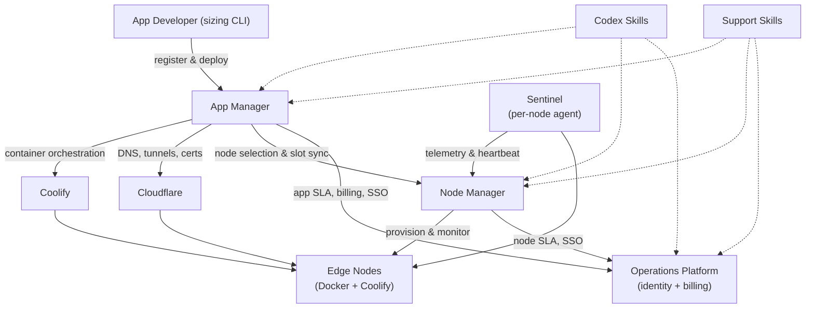

# V-Decent Infrastructure Capabilities

> **Purpose.** Master reference for what the V-Decent infrastructure offers, grounded in the shipped code of six source repositories — `vdecent-node-manager`, `vdecent-app-manager`, `vdecent-operations-platform`, `vdecent-app-sizing`, `vdecent-codex-skills`, `vdecent-support-skills`. Audience-specific briefings are derived from this document.
>
> **Status.** Complete — all sections 1-7 (Ecosystem Overview through Support Skills) and the appended Audience Mapping appendix (section 8) are authored. Audience-specific briefings remain derived documents, extracted from section 8's matrix.

## 1. Ecosystem Overview

### 1.1 What V-Decent Is

V-Decent is a distributed cloud/hosting ecosystem built on a fleet of edge compute nodes — low-cost MiniPCs running Docker and Coolify behind Cloudflare tunnels. The Node Manager operates the hardware layer (node onboarding, telemetry, capacity, uptime SLA) and the App Manager operates the application layer (app registration, deployment, domains, self-healing). Around them sit the Operations Platform, which provides SSO identity and billing against monthly SLA data, a developer-side sizing tool (`vdecent-app-sizing`), and two agent skill packs for AI-assisted operations (`vdecent-codex-skills`, `vdecent-support-skills`).

### 1.2 Component Relationship Diagram

### 1.3 Data Flows

1. **Identity** — The Operations Platform is the identity authority: it signs RS256 JWTs after Google/GitHub OAuth (`vdecent-operations-platform/backend/auth.py`). The Node Manager and App Manager authenticate their users through the Operations Platform (SSO callbacks and internal verification endpoints) and exchange manager-to-manager API calls using a shared internal token.
2. **Billing / SLA** — SLA data flows to the Operations Platform each month: the App Manager's per-app SLA data and the Node Manager's per-node SLA data are captured as month/year-keyed `AppSlaSnapshot` / `NodeSlaSnapshot` rows that feed invoices and payouts (`vdecent-operations-platform/backend/scripts/inject_sla_snapshots.py`).
3. **Telemetry** — Sentinel, a containerized agent on every node, pushes hardware telemetry (CPU, RAM, disk, uptime) and heartbeats to the Node Manager's `/api/webhooks/telemetry`, where heartbeats drive the rolling-30-day SLA and a Dead Man's Switch flags offline nodes (`vdecent-node-manager/backend/sentinel/main.py`). The same agent reports heartbeats to the App Manager webhook so node-slot state stays current; for placement the App Manager picks the highest-scored node that is Online, has a Cloudflare tunnel, and has free slots (`vdecent-app-manager/backend/services/orchestrator.py`).
4. **Deploy / DNS** — The App Manager registers an app from its GitHub repository, analyzes the Compose manifest, creates the application in Coolify on a selected node and triggers the deploy, then programs Cloudflare DNS records and Custom Hostnames to route the app's FQDN through the node's tunnel (`vdecent-app-manager/backend/services/orchestrator.py`, `vdecent-app-manager/backend/clients/coolify.py`, `vdecent-app-manager/backend/clients/cloudflare.py`).

### 1.4 Glossary

Glossary terms are defined once here and reused by later chapters without redefinition.

| Term | Definition |
| --- | --- |
| **VRU** (V-Decent Resource Unit) | Standardized capacity unit. One VRU = 0.2 CPU cores / 0.5 GB RAM / 5 GB disk at node level (`vdecent-node-manager/backend/services/vru_capacity.py`). |
| **Categories S / M / L / XL** | App size tiers occupying 1 / 2 / 4 / 8 VRU slots at the App Manager (`vdecent-app-manager/backend/utils/sizing.py`). |
| **Test Mode** | Trial mode giving one size-S app **30 days free** with no card required (per the public offer at `lp.v-decent.org`): apps register as category N/A with no declared resource limits and are auto-suspended at expiry until promoted to production. The implementation's `TEST_MODE_TTL_DAYS` literal defaults to 14 and `MAX_TEST_APPS_PER_GROUP` to 2 per developer group; the 30-day public trial is the configured offer (`vdecent-app-manager/backend/crud.py`, `vdecent-app-manager/backend/main.py`, `vdecent-app-manager/backend/tasks/testmode_cleanup.py`). |
| **SLA tiers** | Node uptime SLA computed over a rolling 30-day heartbeat window: **FULL** ≥ 99.9%, **PARTIAL** ≥ 95.0%, otherwise **FREE** (`vdecent-node-manager/backend/main.py`). |
| **Sentinel** | Per-node agent container that pushes telemetry and heartbeats to the managers (`vdecent-node-manager/backend/sentinel/main.py`). |
| **Developer Groups** | App Manager scoping unit for visibility and billing (`vdecent-app-manager/backend/models.py`). |
| **Coolify** | Self-hosted PaaS used as the container orchestrator on every node. |
| **Cloudflare** | Provides DNS records, tunnels, and certificates (Custom Hostnames) that route traffic to apps on nodes. |

## 2. App Sizing

### 2.1 Role in the Ecosystem

`vdecent-app-sizing` is the developer-side sizing tool. It is a Python CLI (`vdecent-size`) that profiles a running local Docker Compose stack against the live Docker daemon and computes a standardized V-Decent Resource Unit (VRU) score, resolves the app to a hosting category (S / M / L / XL), and emits a per-service Compose recommendation (`cpus`, `mem_limit`, …) that the developer takes into production. It is the only tool that produces the category semantics ([Section 1.4](#14-glossary), S/M/L/XL = 1/2/4/8 VRU slots) from a real workload, so the App Manager's sizing checks and the Operations Platform's billing both assume its output.

### 2.2 Capabilities Offered

- **`vdecent-size profile` CLI** — the single entry point (`vdecent-app-sizing/vdecent_size/cli.py`), with flags:
  - `--duration <minutes>` (float, required) — profiling window; `duration_seconds = max(1, int(duration * 60))`, so 0.1 gives the minimum ~6-second window.
  - `-f, --compose-file <path>` — path to the Compose file.
  - `-p, --project-name <name>` — target Compose project name.
  - `-o, --output <path>` — JSON report path (default `vdecent-size.json`).
- **Target auto-detection** (`vdecent-app-sizing/vdecent_size/profiler.py`, `detect_project_name`) — three explicit modes plus a daemon fallback:
  1. `--project-name` is used verbatim.
  2. `--compose-file` is read; the YAML top-level `name:` key is used, falling back to the lowercase parent-directory name.
  3. Otherwise the current directory is searched for `compose.yaml`, `compose.yml`, `docker-compose.yaml`, `docker-compose.yml` (same `name:` / lowercase-CWD-name rule).
  4. If none is found, running containers' `com.docker.compose.project` labels are inspected: exactly one running project is auto-selected; several require `-p`/`-f`; none is an error.
- **1-second telemetry ticks** over the window — each tick polls every container's Docker stats concurrently, yielding a live status line (CPU / RAM); the collected history drives project-level averages and peaks.
- **Per-service avg/peak CPU & RAM** — CPU is computed as fractional vCPUs (`cpu_delta / system_delta × online_cpus`); RAM is the working set in GB (`usage − cache`, falling back to `inactive_file`). Each service reports `avg_cpu_vcpus`, `peak_cpu_vcpus`, `avg_ram_gb`, `peak_ram_gb`; project peaks are the maximum observed tick sums.
- **Storage footprint** — total persistent storage in GB = sum of each container's write layer (`SizeRw`), plus **unique** named volumes and **unique** bind mounts (deduplicated across containers). Named volumes are measured from the host mountpoint when readable, otherwise via a temporary `alpine:latest` helper container running `du -sk` on the mounted volume (avoids `/var/lib/docker` permission issues).
- **VRU formula** (`vdecent-app-sizing/vdecent_size/formulas.py`):
  - `base_vru = 0.3 · (avg_cpu / 0.2) + 0.7 · (avg_ram / 0.5)` — i.e. the fraction of one VRU of CPU (0.2 vCPU) and one VRU of RAM (0.5 GB), weighted 30/70.
  - `storage_penalty = max(0, (actual_storage_gb − tier_fair_share_gb) / 25)`.
  - `final_vru = base_vru + storage_penalty`.
- **Tier resolution** — tiers are tested smallest-to-largest because the storage penalty's ceiling depends on the tier; fair-share storage ceilings are S 5 GB / M 10 GB / L 20 GB / XL 40 GB, and final-VRU bounds are **S ≤ 1.2, M ≤ 2.4, L ≤ 4.8**, otherwise **XL**.
- **Per-service Compose recommendation** — the tier's CPU budget (hundredths of a core) and memory budget (MB) are apportioned across services by **largest-remainder** proportional allocation over observed average CPU / RAM. Output per service: `cpus` (fractional), `mem_limit`, `memswap_limit` (= `mem_limit`, no swap headroom), `mem_swappiness: 0`.
- **No-swap rule** — swap is flagged when a container's `HostConfig` allows it (`MemorySwap == -1` unlimited, or `MemorySwap > Memory`) or live swap usage was recorded; the report then prints an alert that swap "violates the strict V-Decent no-swap production architecture rules … can degrade cluster scheduling stability and hide OOM events."
- **Dual output** — an ASCII terminal report (score, tier, telemetry table, storage breakdown, YAML Compose snippet, warnings, deployment instructions) and a machine-readable `vdecent-size.json` (default) containing `project_name`, `duration_minutes`, avg/peak CPU & RAM, `storage_gb`, `storage_penalty`, `vru_score`, `deterministic_size`, `service_metrics`, `compose_recommendation`, and a disclaimer.

### 2.3 Who Interacts with It & How

App developers run the CLI locally before deploying (`pip install -e .`, then `vdecent-size profile --duration 1`). It is CLI-only by design — the tool must attach to the developer's own local Docker daemon and cannot run server-side. Downstream consumption is via the produced artifacts: the reported `deterministic_size` must be given to the App Manager at app registration, the per-service limits are copied into the production Compose file, and `vdecent_size.formulas` can be imported directly by tooling that needs the VRU/tier math without profiling.

### 2.4 Key Constraints & Behaviors

- Requires a **running local Docker daemon with live containers** for the target project; telemetry aborts with an error if no container matches `com.docker.compose.project=<name>`.
- `--duration` is in minutes (float) with a practical floor of ~6 seconds; the window is an integer number of 1-second ticks.
- **RAM is the strict capacity ceiling**: it carries the 0.7 majority weight in the VRU formula, `mem_limit` is emitted as the hard memory cap, and the no-swap rule (`memswap_limit = mem_limit`, `mem_swappiness: 0`, swap-usage alerting) prevents RAM pressure from spilling to disk.
- Storage penalty depends on the resolved tier's fair-share ceiling, which is why tiers are evaluated smallest-to-largest.
- The CLI advises copying the generated per-service limits into the production `docker-compose.yaml` and the resolved size into the App Manager, and recommends moving up a tier if real-world workloads underperform.
- Both the report and the JSON carry a **"test ≠ production" disclaimer**: the sizing reflects the local test, production usage may require more (typically more, since local profiling runs with minimal load).

### 2.5 Source References

- `vdecent-app-sizing/vdecent_size/cli.py` — CLI, report formatting, JSON export.
- `vdecent-app-sizing/vdecent_size/formulas.py` — VRU formula, storage penalty, tier resolution, largest-remainder allocation.
- `vdecent-app-sizing/vdecent_size/profiler.py` — project detection, telemetry loop, CPU/RAM/swap/storage measurement.

## 3. Node Manager

### 3.1 Role in the Ecosystem

`vdecent-node-manager` is the edge-node / hardware orchestration layer. It owns the full lifecycle of the physical fleet: node records are created in a `WAITING_ACTIVATION` state with an activation code, a partner's machine enrolls against that code and is bound to the record, a five-command provisioning queue turns the bare machine into an enrolled node (SSH, Docker, Sentinel, Cloudflare tunnel), and thereafter the Node Manager collects telemetry, computes container-slot capacity and per-node VRU capacity, tracks uptime SLA for billing, and retires or self-decommissions nodes on exit. Its per-node ingress priority score (0–1000) is what the App Manager uses to pick where an app is placed, and it pushes node-status changes back to the App Manager.

### 3.2 Capabilities Offered

- **Node registration & provisioning**:
  - A node record is registered by an operator/partner via the admin console or API with status `WAITING_ACTIVATION`; registration issues a **single-use activation code** in the form `VDC-XXX-XXX` — six characters drawn from `ABCDEFGHJKMNPQRSTUVWXYZ23456789` group 3+3 for readability (`vdecent-node-manager/backend/main.py`, `generate_activation_code`).
  - Codes **expire after `ACTIVATION_CODE_TTL_HOURS`** (default **72 h** via `get_code_ttl`, floor 1 h) and can only be refreshed while the node is still waiting for activation. At enrollment, matching is case/dash-insensitive, and used or expired codes are rejected.
  - The bootstrap flow is agent-downloaded, not bundled: `GET /nodes/agent-bundle` streams a zip of `register-node.sh`, the Python agent (`vdecent_agent.py`), the Sentinel sources, `cleanup-node.sh` (decommission path), the partner agreement, and a README; `GET /install` serves a bootstrap script that fetches the bundle, unpacks it, and runs `register-node.sh` on the node (`vdecent-node-manager/backend/node-agent/register-node.sh`).
  - On enrollment (`POST /enroll`) the machine's MAC/`machine_uuid` are bound, the node adopts the platform's hostname, status transitions to `ACTIVATED`, and **five provisioning commands are enqueued** in this exact order (`vdecent-node-manager/backend/main.py`):
    1. `INITIAL_SETUP` — hostname, SSH public key, sentinel token, AM heartbeat URL.
    2. `CONFIGURE_SSH` — rebind sshd to the node's configured SSH port and restart it.
    3. `INSTALL_DOCKER` — install the Docker engine.
    4. `SETUP_SENTINEL` — launch the Sentinel container with its tokens and webhook URLs.
    5. `SETUP_CLOUDFLARE` — queued as `PREPARING`; the tunnel/DNS/Coolify bring-up runs in the background.
  - The agent polls `GET /nodes/{node_id}/commands` on a ~15–30 s loop and reports each command through `POST /nodes/{node_id}/commands/{command_id}/report`, from which the Node Manager derives a **global provisioning progress** (monotone ranges: `INITIAL_SETUP` 5–25, `CONFIGURE_SSH` 25–45, `INSTALL_DOCKER` 45–65, `SETUP_CLOUDFLARE` 65–85) and moves node status through `DOCKER_INSTALLING` / `SSH_CONFIGURING` to fully enrolled. The agent's reported hardware specs feed the VRU capacity calculation.
- **Sentinel telemetry + Dead Man's Switch** — the Sentinel container (`vdecent-node-manager/backend/sentinel/main.py`) runs a loop every `INTERVAL_SECONDS` (default **60 s**) and pushes to two targets:
  - `POST /api/webhooks/telemetry` (Node Manager): `node_id` + sentinel token auth, CPU/RAM/disk percent, network rx/tx bytes, uptime, and an SSH-health flag. The Node Manager records that interval's heartbeat window, updates live telemetry, throttles the history sample into 5-minute buckets (`SAMPLE_CADENCE_SECONDS = 300`), recomputes the ingress priority score, and flips any `OFFLINE`/`ERROR` node back to `ONLINE`.
  - the App Manager heartbeat webhook — per-Compose-project container health inventory (Healthy/Unhealthy, CPU/RAM) that keeps App Manager's node view current.
  - A periodic `run_global_health_check` (every `NODE_HEARTBEAT_INTERVAL_SECS`, default 60 s) is the **Dead Man's Switch**: a node is declared offline when its last heartbeat is older than `heartbeat_interval_seconds × HEARTBEAT_TIMEOUT_MULTIPLIER` (multiplier `3` in `vdecent-node-manager/backend/services/sla.py`; default grace ≈ **180 s**). The node is marked `OFFLINE` and the App Manager is notified.
- **VRU capacity per node** (`vdecent-node-manager/backend/services/vru_capacity.py`) — total capacity is the **most restrictive** resource dimension divided by the VRU base of **0.2 CPU cores / 0.5 GB RAM / 5 GB disk**, rounded down: `min(cpu/0.2, memory/0.5, storage/5)`. `total_vru_capacity` and the deployable `app_capacity_slot` are synchronized whenever the agent reports specs, preserving any operator-set manual limit that is lower.
- **App-capacity slot accounting** — each node tracks `app_capacity_slot` (total VRU slots) versus `app_slot_occupied` (slots currently claimed by deployed apps); App Manager updates usage through the installed-apps endpoints (`GET`/`PATCH /nodes/{node_id}/installed-apps`), and the ingress score only considers nodes with free slots.
- **Ingress priority scoring 0–1000** (`vdecent-node-manager/backend/services/scoring.py`):
  - Status gate first: only `ONLINE`/`SSH_READY` nodes that reported within the last 5 minutes and have positive free slot capacity are scored (others score 0).
  - **Capacity (max 400)** — `remaining_slots / capacity_slots × 400`.
  - **Live telemetry headroom (max 300)** — `(100 − cpu%) + (100 − mem%) + (100 − disk%)`, with an overload penalty of −150 (floored at 0) if any of CPU/memory/disk exceed **90%**.
  - **Partner incentive (max 300)** — partner points capped at 1000, scaled by 0.3.
  - Sum is taken as an integer and clamped to `[0, 1000]`; recomputed on every telemetry webhook.
- **SLA tracking + tiers** (`vdecent-node-manager/backend/services/sla.py`) — uptime is measured in **heartbeat windows**: at most one pulse counts per interval (default 60 s), deduplicated by `unix_ts // interval`. `calculate_window_sla` returns `received/expected × 100` over a period, and trailing windows inside the `3 × interval` grace period are not yet classified. Tiers (`vdecent-node-manager/backend/main.py`): **FULL** ≥ `SLA_FULL_PERCENTAGE` (default **99.9%**), **PARTIAL** ≥ `SLA_PARTIAL_PERCENTAGE` (default **95.0%**), otherwise **FREE**. Each node offers a rolling 30-day SLA view plus up to 12 months of calendar history.
- **Billing export for Ops Platform** — `GET /api/v1/billing/nodes-sla?month=&year=` exports a calendar-month snapshot for every node: SLA percentage, received/expected pulses, heartbeat interval, total VRU capacity, partner identity (including regional-master vs `sub_partners`), currency (`BRL`), and the active tier thresholds — the data the Operations Platform reconciles into payouts.
- **IAM / multi-tenant** — local users (Admin/Viewer roles, username+password) and **Ops-SSO accounts** resolved through `POST /auth/oauth-session` using the roles the Operations Platform already granted (`GLOBAL_ADMIN`, `LOCAL_ADMIN`, `OP_OPERATOR`, `NODE_PARTNER`); OAuth-managed accounts are read-only in the Node Manager console. Visibility is hierarchical: partners are scoped (`get_visible_partner_ids`), a regional-master partner (`is_regional`) covers its `sub_partners`/children, and non-global users only see nodes of visible partners.
- **Google Drive backups** — the backend proxies to a **backup sidecar** (`vdecent-node-manager/sidecar/backup.py`) that `pg_dump`s the database and uploads the file to Google Drive (Drive v3 API); endpoints `GET /system/backups`, `POST /system/backup`, and `POST /system/purge`.

### 3.3 Who Interacts with It & How

- **Node partners** — enroll their own hardware: they run the bootstrap script (`/install` download or the agent bundle), are prompted for their `VDC-XXX-XXX` activation code, and then watch provisioning progress, telemetry, and SLA of their nodes in the web console. Self-decommissioning is available via the cleanup script (`cleanup-node.sh`).
- **Operators / administrators** — the console: register node records and issue/refresh activation codes, review enrollment and provisioning logs, set system settings (heartbeat interval, SLA thresholds, activation-code TTL), manage local/Ops users and partner hierarchies, and trigger backups. REST API on **port 3001** (uvicorn `--port 3001`, `vdecent-node-manager/docker-compose.dev.yaml`), gated by a static API token plus per-user auth.
- **Node agents** — the bootstrap agent (`vdecent_agent.py`) and the Sentinel container are the machine-side actors; the agent polls and executes the command queue, the Sentinel pushes heartbeats/telemetry.
- **App Manager** — consumes node status, capacity slots, and ingress priority scores for placement decisions, updates slot occupancy, and receives `node-status` webhooks (`Online`/`Offline`, including Dead Man's Switch timeouts) at `POST /api/webhooks/node-status`.

### 3.4 Key Constraints & Behaviors

- **Enrollment is gated on demand**: if no node is in `WAITING_ACTIVATION`, the `/enroll` endpoint rejects the attempt (404) and logs a security event — the platform must be opened for enrollment (by creating a node record) before any machine can join.
- **Activation codes** are single-use, TTL-limited (default 72 h), and refreshable only while the node still waits for activation; used or expired codes are rejected at enrollment.
- The enrolling machine **adopts the platform-assigned hostname** for its node; the address/identity the platform manages is the record's, not the hardware's.
- **Retired hostnames are permanently reserved**: deletion of an activated node retires it (record, command/uptime history and partner association preserved for billing and audit), and its hostname cannot be reused. Nodes that never activated are hard-deleted.
- **Dead Man's Switch**: offline detection at `3 × heartbeat interval` (default ≈ 180 s); recovery is automatic on the next telemetry heartbeat.
- **Network posture**: Sentinel/agent traffic is outbound to the manager webhooks; node access (including SSH) is routed through the Cloudflare tunnel rather than exposed directly — the agent rebinds `sshd` to the node's configured SSH port and installs the Manager's public key (notably, it leaves `PasswordAuthentication`/`PermitRootLogin` as found; no firewall rules are applied by the provisioning code).
- System timezone defaults to **`America/Sao_Paulo`** (`TIMEZONE`); SLA windows are computed in UTC.
- The backend API listens on **port 3001**; the node agent's default Node Manager URL is `http://localhost:3001` for local testing.

### 3.5 Source References

- `vdecent-node-manager/backend/main.py` — API, registration/enrollment, 5-step command queue, Dead Man's Switch, SLA tiers, billing export, IAM, backups.
- `vdecent-node-manager/backend/services/vru_capacity.py` — VRU capacity formula and slot synchronization.
- `vdecent-node-manager/backend/services/scoring.py` — ingress priority scoring (0–1000).
- `vdecent-node-manager/backend/services/sla.py` — heartbeat-window SLA math and timeout multiplier.
- `vdecent-node-manager/backend/services/telemetry.py` — on-demand SSH telemetry refresh path.
- `vdecent-node-manager/backend/sentinel/main.py` — Sentinel agent loop and telemetry/heartbeat pushes.
- `vdecent-node-manager/backend/node-agent/vdecent_agent.py`, `vdecent-node-manager/backend/node-agent/register-node.sh` — bootstrap and command execution.
- `vdecent-node-manager/sidecar/backup.py` — `pg_dump` + Google Drive upload.

## 4. App Manager

### 4.1 Role in the Ecosystem

`vdecent-app-manager` is the application-orchestration layer of the platform. It owns the full lifecycle of a containerized application, from registration of a GitHub repository to a `Healthy` deployment running on a selected edge node behind a Cloudflare-routed FQDN: it analyzes the Compose manifest, reserves slots on a node (using Node Manager telemetry and the ingress priority score), creates and deploys the application through Coolify on the node, programs DNS and Custom Hostnames through Cloudflare, and then keeps the app self-healing (heartbeat watchdog, relocation, desired-state reconciliation). It also produces the per-app SLA data that the Operations Platform invoices against. Where the Node Manager ([Section 3](#3-node-manager)) owns the hardware fleet, the App Manager owns the payloads running on it.

### 4.2 Capabilities Offered

- **App registration & Compose analysis** (`vdecent-app-manager/backend/main.py`, `vdecent-app-manager/backend/services/orchestrator.py`):
  - Registration (`POST /api/applications`, admin-gated via `check_admin`) stores the repo URL, branch (default `main`), repo type (`Public`/`Private`), GitHub account, per-service `service_mappings`, environment variables, and the declared size. **Registration is separate from deployment** — an app can be registered and analyzed without being deployed.
  - Public repos are read over HTTP (raw `docker-compose.yaml`, `master` fallback); private repos are read via a shallow SSH clone (`git clone --depth 1 --no-checkout`) using a **GitHub deploy key** that the platform installs on the repo (title "V-Decent Coolify Deploy Key", read-only). Resolving the correct key follows a tiered lookup: the triggering user's `coolify_private_keys_id`, then the GitHub account owner, then the developer group's key, then the system default (`COOLIFY_PRIVATE_KEYS_ID`).
  - `POST /api/applications/analyze` fetches and validates the manifest: parses `services`, checks every service declares `cpus` and `mem_limit`, and computes the **minimum category** the aggregate resource totals require (see Sizing Enforcement below). A port for routing is detected from the manifest (`expose` first, then `ports`, then a `PORT=` env var, defaulting to `80`), overridable via `PORT=` in the UI's env vars.
  - App cannot be registered under an FQDN already used by another application; uniqueness is enforced by DB unique constraints plus an application-level availability check that also accounts for registered (reserved) domain records.
- **Deployment pipeline** (`vdecent-app-manager/backend/tasks/deployment_queue.py`, `vdecent-app-manager/backend/services/orchestrator.py`):
  - Deploy/redeploy requests enqueue a `DeploymentJob` row (operation `Deploy`/`Redeploy`, requested-by, status `Queued`); a **per-application lock** plus a DB unique index on active jobs guarantees one in-flight job per app. The `DeploymentQueueTask` claims jobs **FIFO by `created_at`** with `FOR UPDATE SKIP LOCKED`, leases them for 2 h, and processes up to **2 concurrent workers** (`DEPLOYMENT_WORKERS`, default 2). A job whose lease expires is marked `Failed` and the app `Error`.
  - Mainline status pipeline for an application: **`Registered` → `DeployQueued` → `Deploying` → `Running` → `Healthy`**. Companion states include `DeployQueuedTimeout` (Coolify did not leave queued within `max_polls × 10 s`), `DeployFailed`, `Unhealthy`, `Stopped`, `Suspended`, `Error`, `Removed`. The app's `desired_state` (`Registered`/`Running`/`Suspended`) records durable intent.
  - **`Healthy` is gated on public HTTPS verification** (`_verify_public_accessibility`): after Coolify reports the deployment `Running`, a background task waits 60 s, then issues `GET https://<fqdn>` (explicit `Host` header, no cert verification) up to 30 times at 30 s intervals; any **2xx/3xx response** promotes the deployment to `Healthy` and marks `has_ever_been_healthy`. A verify failure sets `Unhealthy` with a reason (crash vs. unreachable-while-running).
  - The pipeline runs as a 5-step domain/dns dance with Coolify: create the application on the node's server/destination (`build_pack=dockercompose`), poll until Coolify has parsed the manifest, patch `docker_compose_domains`, trigger the deploy (`/api/v1/deploy?force=true`), and track deployment lifecycle by polling `/api/v1/deployments/<uuid>`.
- **Weighted node selection** (`vdecent-app-manager/backend/services/orchestrator.py`):
  - An eligible-node filter rejects nodes that are not `Online`, that have **no `cloudflare_tunnel_id`** (every routing scenario needs the tunnel), or whose remaining slots (`app_capacity_slot − app_slot_occupied`) fall below the category's required slots. A global `_selection_lock` prevents over-allocation across concurrent deploys.
  - Among eligible nodes, selection picks the highest `node_selection_score`: capacity `(1 − occupied/capacity) × 400`, live telemetry headroom `(300 − (cpu+mem+disk))/300 × 300` with a **−150 penalty when CPU or memory exceeds 90%**, and partner incentive `priority_weight/1000 × 300` — floored at 0, matching the Node Manager's 0–1000 scale. Node rows and scores are refreshed from the Node Manager periodically (`NodeSyncTask`, default 900 s) and on demand.
- **Self-healing**:
  - **Heartbeat watchdog** (`vdecent-app-manager/backend/tasks/heartbeat_watchdog.py`): every Sentinel heartbeat stamps `last_heartbeat_at` on the affected deployment. The watchdog (default interval 60 s) flips any `Healthy` deployment whose heartbeat is older than **`heartbeat_staleness_threshold_seconds` (default 300 s = ~5 min)** to `Unhealthy`, logging `HEARTBEAT_TIMEOUT`.
  - **Self-heal rebuild** (`vdecent-app-manager/backend/routers/webhooks.py`): when a Sentinel heartbeat reports a container `Unhealthy`/crashed and the deployment hasn't already been rebuilt (`healing_rebuild_attempted` — `sic`, the field name as written in the source), the App Manager triggers a Coolify rebuild in the background.
  - **Relocation queue** (`vdecent-app-manager/backend/tasks/relocation_queue.py`, `vdecent-app-manager/backend/services/orchestrator.py`): when a fresh deployment fails to recover (e.g. node failure during relocation), apps that `has_ever_been_healthy` are enqueued (`RelocationQueue`, status `Pending`/`Retrying`/`Failed`/`Completed`). The task (default interval 180 s) retries **every 5 minutes up to attempt 6, then every 10 minutes up to attempt 9**, after which the app is marked `Error` and the queue entry dropped. `relocate_application` marks the old deployment `CleanupPending`, blanks its Coolify domains, then runs a fresh deployment on another node; `cleanup_relocated_deployments` purges the old Coolify resource once a `Healthy` replacement exists.
  - **Application reconciler** (`vdecent-app-manager/backend/tasks/application_reconciler.py`): every 60 s it converges apps whose `desired_state = Running` back to running — skipping any app with an active job, skipping a live non-`Unhealthy` deployment unless its node is `Offline` past the **300 s offline grace** (`NODE_OFFLINE_GRACE_SECONDS`), and honoring a **300 s recovery cooldown** after a last deploy success. When recovery is warranted it enqueues a deploy job (reusing the existing Coolify resource when one exists) and sets the app to `DeployQueued`.
  - **Garbage collection** (`vdecent-app-manager/backend/tasks/garbage_collection.py`): hourly reconciliation of Coolify against the local registry, purging "zombie" Compose projects that have a matching `vdecent.manager-id` owner label, are ≥15 min old, and are not in the protected-services list (`nm-`, `am-`, `coolify`, `sentinel`, `traefik`, …). Safe-guards refuse to run when the local registry is empty.
- **Domain management — three scenarios** (`vdecent-app-manager/backend/routers/domains.py`, `vdecent-app-manager/backend/clients/cloudflare.py`, `vdecent-app-manager/backend/tasks/domain_verifier.py`):
  1. **Default `*.v-decent.org`** (`scenario_type 1`) — a subdomain of `DEFAULT_DOMAIN` (default `v-decent.org`) matching `^[a-z0-9]([a-z0-9-]{0,61}[a-z0-9])?$`; the App Manager writes/updates a **CNAME to `<tunnel-id>.cfargotunnel.com`** in the system Cloudflare zone and registers a per-group wildcard ingress on the Node Manager.
  2. **Internal Cloudflare zone** (`scenario_type 2`) — the developer supplies their own zone; `validate_internal_cloudflare_zone` verifies the zone actually serves the FQDN (`GET /zones/{id}`), the domain is `active` immediately, and a CNAME → `<tunnel-id>.cfargotunnel.com` plus a Node Manager global ingress route is applied.
  3. **External SaaS** (`scenario_type 3`) — the FQDN becomes a **Cloudflare Custom Hostname** (`POST /custom_hostnames`, `ssl.method=txt`), status `pending_verification`. The `DomainVerifierTask` (default 300 s) polls Cloudflare until `status == active` and `ssl.status == active`, then marks it active. Domains that fail to verify within **`domain_verification_timeout_hours` (default 72 h)** are marked `failed` and must be re-registered. Because Cloudflare requires the Custom Hostname origin to be a DNS record in the same zone, routing uses the node's existing in-zone alias `{node.name}.v-decent.org` → the tunnel, and subdomain auto-registration extends SaaS mapping to per-service sub-hosts. Node Manager ingress routes are added/removed in lock-step with domain create/delete.
- **Test Mode** (`vdecent-app-manager/backend/crud.py`, `vdecent-app-manager/backend/tasks/testmode_cleanup.py`, `vdecent-app-manager/backend/main.py`) — the public offer's **30-day free trial** for one size-S app (no card required; `lp.v-decent.org`). Registering with `is_test_mode` or category `N/A` sets a trial TTL (code literal `TEST_MODE_TTL_DAYS` defaults to 14), stores the category as `N/A` (free, `0.0` price, 1 slot) and skips per-service limit validation. **`MAX_TEST_APPS_PER_GROUP` (default 2)** caps concurrent test apps per developer group. The `TestModeCleanupTask` (default 60 s) auto-suspends expired apps (`desired_state/status = Suspended`, stop Coolify resources, `TEST_APP_EXPIRED` log); expired apps are also refused at deploy time. `POST /api/applications/{id}/promote` converts the app to a production category (re-validating that the manifest declares limits unless the target is Extra Large) and clears the trial.
- **Sizing enforcement & categories** (`vdecent-app-manager/backend/utils/sizing.py`): categories are **aggregate resource entitlements** — S = 0.2 CPU / 512 MB / 1 slot, M = 0.4 / 1024 MB / 2, L = 0.8 / 2048 MB / 4, XL = 1.6 / 4096 MB / 8 (test `N/A` is 1 slot with the XL 1.6/4096m ceiling). At registration and deploy, `inspect_manifest_resources`/`analyze_compose_resources` require every service to declare `cpus` and `mem_limit` (each strictly positive, memory in a parsed unit), unless the app is in Test Mode, `resource_limits_exempt` (admin-only), or category **Extra Large**. The aggregate must fit the category, and the app's category must meet the manifest's computed **minimum category** — else registration is refused with the offending services named. Per-service runtime limits stay owned by the Compose file; resizing only updates the aggregate entitlement (`SIZE_ENTITLEMENT_UPDATED`).
- **SLA + billing** (`vdecent-app-manager/backend/tasks/sla_calculator.py`, `vdecent-app-manager/backend/routers/billing.py`):
  - Sentinel heartbeats accumulate daily `ApplicationUptimeHistory` rows (`success_count`/`total_count`) for live apps. The `SLACalculationTask` (default 3600 s) re-derives `sla_30d` over a **rolling 30-day window** and assigns a tier: **FULL ≥ 99.9% (`SLA_FULL_PERCENTAGE`), PARTIAL ≥ 95.0% (`SLA_PARTIAL_PERCENTAGE`), otherwise FREE** — the same thresholds the Node Manager uses for uptime tiers.
  - `GET /api/v1/billing/applications-sla?month=&year=` exports the calendar-month snapshot for the Operations Platform: per-app `sla_30d`, owner (developer group + `financial_model` referral/resale/none), size label (`S`/`M`/`L`/`XL`), `fixed_monthly_price` and `currency: BRL`, together with the active FULL/PARTIAL thresholds. Public monthly prices per the offer at `lp.v-decent.org` are **S R$49 / M R$89 / L R$179, XL by individual evaluation** (paid in BRL). The code's `S_SIZE_APP_PRICE` literal defaults to `R$ 49.99` and the `× slots` (1x/2x/4x/8x) scheme is the implementation default; actual prices are the configured public offer, updated separately.
- **IAM** (`vdecent-app-manager/backend/main.py`, `vdecent-app-manager/backend/models.py`) — users authenticate to the App Manager through the Operations Platform SSO, `POST /api/auth/google/callback` and `POST /api/auth/github/callback`; the persisted `roles` JSON holds the canonical Operations roles (`GLOBAL_ADMIN`, `OP_OPERATOR`, `APP_OWNER`, `AM_VIEWER`, `NODE_PARTNER`, …) refreshed on every login, with a legacy fallback to the local `role`/`visibility_group`. Authorization is role-gated (`check_admin` for register/deploy/delete, `check_global_admin` for global administration) and data-scoped by `visibility_group` (a single developer group). Developer groups are the billing and visibility unit; each group can carry its own Coolify deploy key and financial model.
- **Backups & logs** — a **backup sidecar** (`vdecent-app-manager/sidecar/backup.py`) `pg_dump`s the database and uploads the file to **Google Drive** (Drive v3 API, credentials via file or `GOOGLE_CREDENTIALS_B64`/`GOOGLE_TOKEN_B64`), honoring a retention count (default 24) with a purge step; it can restore the latest backup on a cold start. Every change is captured in structured `SystemLog` rows (`event_type` such as `APP_REGISTER`, `DEPLOY_SUCCESS`, `HEARTBEAT_TIMEOUT`, `RELOCATION_FAILED`, `DNS_UPDATE_SUCCESS`, `GC_PURGE`, category `APPLICATION`/`INFRASTRUCTURE`/`SYSTEM`, `developer_group_id`/`application_id` tags for filtering).

### 4.3 Who Interacts with It & How

- **App developers** — the web UI (and the REST API it calls) to register a GitHub repo (public or private, with a one-click GitHub deploy-key install), inspect the Compose analysis, supply env vars and service mappings, register/deploy/verify domains in all three scenarios, deploy and redeploy, promote from Test Mode, browse per-service resource metrics (live + recommended tier from the `resolve_tier_and_vru` math), read container logs, and watch per-app 30-day SLA.
- **Admins / operators** — manage users (roles and visibility scoping), developer groups, system settings (queue intervals, heartbeat thresholds, verification timeouts, backup cadence), trigger node sync, and trigger on-demand reconciliation; backups/restores are operated through the sidecar and its endpoints.
- **Operations Platform** — pulls the monthly `applications-sla` billing snapshot and performs billing-critical suspend/resume flows through the Apps API; SSO logins carry canonical roles into the App Manager.
- **Sentinel container** — posts per-Compose-project container health/CPU/RAM inventory to `POST /api/webhooks/heartbeat` on the Sentinel loop (default 60 s). That heartbeat is what stamps `last_heartbeat_at`, accumulates the uptime history, and feeds the 300 s staleness watchdog; a heartbeat-reported `Unhealthy` also triggers the one-shot self-heal rebuild.
- **Node Manager** — the App Manager polls `GET /nodes` on the sync cadence (default 900 s and on demand), pushes slot occupancy deltas (`PATCH /nodes/{id}/installed-apps` ADD/REDUCE), requests/removes global ingress routes, and receives `node-status` webhooks (`Online`/`Offline`, plus confirmations of a deleted node that trigger immediate relocation of stranded apps).

### 4.4 Key Constraints & Behaviors

- **No host port mappings**: Compose files must not map physical ports to the host (e.g. `ports: ["8080:80"]`); they must use `expose` to signal the internal port to the proxy. All ingress is managed by the platform (`docs/vdecent-app-developer-manual.md`).
- **No custom networks**: defining custom/internal networks in `docker-compose.yaml` (e.g. `external-tier`, or joining `vdecent-ingress`) breaks the Coolify/Traefik integration and is forbidden; the platform manages network attachment.
- **Labels injected automatically**: before a manifest reaches Coolify, the App Manager injects into every service `vdecent.managed=true`, `vdecent.application-id=<id>` and (when set) `vdecent.manager-id`; public services additionally get `coolify.managed=true`. Routing to the internal **Traefik proxy** is derived from the mapped `docker_compose_domains` (per-service, service-mapping aware, with `expose`d port suffixes).
- **FQDN uniqueness is global**: primary `fqdn` and `service_mappings` are checked against every other application *and* the registered-domains table at register and update time (409 on clash); unique DB constraints back both `applications.fqdn` and `domains.fqdn`.
- **Category is an aggregate entitlement**: the category fixes the total CPU/RAM budget, slots, and price; per-service limits remain the developer's `docker-compose.yaml`. Slot booking, sizing validation, and billing all key off the category.
- **Node eligibility requires a Cloudflare tunnel**: nodes without a `cloudflare_tunnel_id` are never selected, because every routing scenario routes through the tunnel (without it the app deploys but is silently unreachable).
- **Delete is refused while the node is offline**: `delete_application` raises rather than remove a deployment whose node is not `Online`, because runtime cleanup cannot be confirmed without the node.
- **Test Mode caps and expiry block deployment**: expired test apps cannot deploy until promoted, and a missed promotion surfaces as `Suspended`.
- **Self-healing is time-bounded**: `Healthy` without a heartbeat for 300 s → `Unhealthy`; relocation retries for at most 9 attempts before flipping to `Error`; SaaS domain verification gives a strict 72 h window.

### 4.5 Source References

- `vdecent-app-manager/backend/main.py` — API: registration/analyze/deploy/promote/resize, FQDN availability checks, SSO callbacks, role gates, background-task wiring.
- `vdecent-app-manager/backend/services/orchestrator.py` — deployment lifecycle, node selection, DNS/domain routing per scenario, relocation, reconciliation, deletion, slot sync.
- `vdecent-app-manager/backend/models.py` — `Application`, `Domain`, `Deployment`, `DeploymentJob`, `RelocationQueue`, `ApplicationUptimeHistory`, `DeveloperGroup`, `SystemLog`, `User` schemas.
- `vdecent-app-manager/backend/crud.py` — test-mode TTL/expiry/quota helpers, relocation-queue upsert, telemetry/uptime accounting.
- `vdecent-app-manager/backend/tasks/deployment_queue.py` — FIFO worker queue (2 workers, 2 h lease, per-app dedup).
- `vdecent-app-manager/backend/tasks/heartbeat_watchdog.py` — Healthy→Unhealthy staleness watchdog (300 s default).
- `vdecent-app-manager/backend/tasks/application_reconciler.py` — desired-state recovery (`desired_state = Running`).
- `vdecent-app-manager/backend/tasks/relocation_queue.py` — retry scheduling for failed relocations.
- `vdecent-app-manager/backend/tasks/sla_calculator.py` — rolling-30-day SLA tiers (99.9/95.0).
- `vdecent-app-manager/backend/tasks/domain_verifier.py` — Custom Hostname verification with 72 h timeout.
- `vdecent-app-manager/backend/tasks/testmode_cleanup.py` — auto-suspension of expired trials.
- `vdecent-app-manager/backend/tasks/garbage_collection.py` — zombie Coolify-project purge.
- `vdecent-app-manager/backend/clients/coolify.py` — Coolify v4 client (create/update/env/log/deploy/delete), domain-conflict detection, Traefik domain mapping.
- `vdecent-app-manager/backend/clients/cloudflare.py` — DNS records + Custom Hostnames.
- `vdecent-app-manager/backend/clients/node_manager.py` — node fetch, slot updates, global ingress routes.
- `vdecent-app-manager/backend/utils/sizing.py` — category tables, slots, prices, resource-limit validation, VRU math.
- `vdecent-app-manager/backend/routers/billing.py` — monthly `applications-sla` billing export.
- `vdecent-app-manager/backend/routers/domains.py` — domain registration/verification for the three scenarios.
- `vdecent-app-manager/backend/routers/webhooks.py` — Sentinel heartbeat + Node Manager node-status webhooks.
- `vdecent-app-manager/sidecar/backup.py` — `pg_dump` + Google Drive backup/restore/purge.
- `vdecent-app-manager/docs/vdecent-app-developer-manual.md` — developer constraints (no host ports, no custom networks).

## 5. Operations Platform

### 5.1 Role in the Ecosystem

`vdecent-operations-platform` is the **identity and financial authority** of the ecosystem. It is the single sign-on (SSO) provider for the App Manager and Node Manager, issuing RS256-asymmetric JWTs that those managers validate when accepting users ([Section 1.3](#13-data-flows)); it runs the onboarding request/review/approval flow through which every partner and developer account is created; and each month it reconciles the App Manager's per-app and Node Manager's per-node SLA snapshots into a **triple ledger** — inbound invoices to app owners, outbound payout receipts to node partners, and internal expense/reimbursement records. It owns the money-facing documents: invoices and payout receipts are generated as digitally signed PDFs and archived to Google Drive. Around this core sit operator-facing administration (users, roles, developer financial models, system settings, backups) and a public pricing endpoint.

### 5.2 Capabilities Offered

- **SSO identity provider** (`vdecent-operations-platform/backend/auth.py`, `vdecent-operations-platform/backend/routers/auth.py`):
  - **Google OAuth** — `GET /api/v1/auth/google/login` builds the authorization URL (redirect URI must match the `GOOGLE_ALLOWED_REDIRECT_URIS` allow-list); both a JSON `POST /api/v1/auth/google/callback` (ID token or code) and a redirect-based `GET` callback (server-side code exchange) are supported, verifying the token via Google's `verify_oauth2_token` and requiring `email_verified`.
  - **GitHub OAuth** — `GET /api/v1/auth/github/login` + `POST /api/v1/auth/github/callback` exchange the code for an access token, fetch the profile and the **verified primary email** (required); a one-time GitHub access token is returned to the caller (the Ops Platform never persists it).
  - **RS256 JWTs** — `create_jwt_token` signs a payload with a **2048-bit RSA private key** (header `kid: vdecent-ops-key-2026`, `alg: RS256`; issuer `https://ops.v-decent.org`; audience `["vdecent-ops", "vdecent-nm", "vdecent-am"]`). Standard **JWKS** is served at `GET /api/v1/auth/jwks` and a raw-PEM variant at `GET /api/v1/auth/public-key` for OpenID/RFC 7517 consumers. If RSA keys are absent it degrades to HS256 with `JWT_SECRET` (dev fallback only). Keys are auto-generated into `.env` when missing (`vdecent-operations-platform/backend/utils/key_generator.py`).
  - **Break-glass admin** — `POST /api/v1/auth/break-glass/login` is an emergency root-password (bcrypt) login **restricted to `GLOBAL_ADMIN`**; it returns a `LOCAL_ADMIN`-scoped token flagged `isBreakGlass: true`, a 4-hour session, and writes a `WARN` audit entry. The root admin is bootstrapped from `INITIAL_ADMIN_EMAIL` (default `luizcarloskazuyukifukaya@gmail.com`) on its first Google sign-in.
  - **Sessions** — the web UI gets an HttpOnly `vdecent_session` cookie (Secure, SameSite=Lax, 8 h; 4 h for break-glass); API clients authenticate with its Bearer token.
- **Multi-role accounts** — one user holds a `roles` list (plus a legacy single `role`). Canonical OAuth roles (`vdecent-operations-platform/backend/routers/oauth_users.py`): **`GLOBAL_ADMIN`, `OP_OPERATOR`, `NODE_PARTNER`, `APP_OWNER`, `OP_VIEWER`, `AM_VIEWER`, `NM_VIEWER`**; local fallback roles `LOCAL_ADMIN`/`LOCAL_VIEWER` and legacy renames ADMIN→`GLOBAL_ADMIN`, OPERATOR→`OP_OPERATOR`, VIEWER→`LOCAL_VIEWER` round out the set (`vdecent-operations-platform/backend/roles.py`). `GLOBAL_ADMIN` implies all other roles for gate checks only (never persisted expanded). Gate helpers in `auth.py`: operators need `OP_OPERATOR`/`LOCAL_ADMIN`, admins `GLOBAL_ADMIN`/`LOCAL_ADMIN`.
- **Onboarding request/review/approve** (`vdecent-operations-platform/backend/routers/onboarding.py`):
  - `POST /api/v1/onboarding/apply` is a public self-registration that cryptographically verifies a Google ID token or GitHub code, then records a `PENDING` request with source app (`NODE_MANAGER`/`APP_MANAGER`/`OPS_PLATFORM`), requested role (`NODE_PARTNER`, `APP_OWNER`, `OP_OPERATOR`, `GLOBAL_ADMIN`), contact/business metadata, and the chosen financial model. Duplicate/identical applications return `ALREADY_ACTIVE` or `PENDING_APPROVAL`.
  - Operators review via `GET /api/v1/onboarding/requests` (+ `/requests/{id}`), may edit draft metadata (`PATCH /requests/{id}/resource`) before deciding. `POST /requests/{id}/approve` **verifies the operator-selected resource against the source manager first** (developer group via App Manager for `APP_OWNER`, partner via Node Manager for `NODE_PARTNER`, both must be `ACTIVE`), then activates the Ops user, binds `am_group_id`/`nm_partner_id`, creates the `DeveloperPartner` row, and returns an audit log line. `POST /requests/{id}/reject` records a rejection reason.
  - Re-binding an existing email to the **other OAuth provider** (Google↔GitHub) is treated as a privileged account takeover and is restricted to `GLOBAL_ADMIN` (requires `force_provider_switch`).
  - `GET /api/v1/onboarding/accounts/verify` is the **internal verification endpoint** for App Manager / Node Manager, gated by the shared `INTERNAL_API_TOKEN` header; it returns status, canonical roles, and the linked `nm_partner_id`/`am_group_id` (or `PENDING_APPROVAL`/`NOT_FOUND`).
- **Inbound billing — monthly invoices** (`vdecent-operations-platform/backend/tasks/monthly_reconciliation.py`, `vdecent-operations-platform/backend/routers/billing.py`):
  - Each cycle pulls the App Manager's `applications-sla` export into `AppSlaSnapshot` rows (one per app per month/year). A month's **SLA-tier thresholds are locked on the first sync** — re-syncing a past month refreshes SLA % data but preserves the thresholds that were in force when the period was first billed.
  - Per-app amount = **base price × size multiplier × SLA tier rate**: base `inbound_s_price` (default **R$ 49.99**), multipliers S=1 / M=2 / L=4 / XL=8 (configurable), and tier rates **FULL** 100% / **PARTIAL** 75% / **FREE** 0% (configurable). One `BillingOrder` per owner per period aggregates its apps (owner SLA = amount-weighted average); it is `PENDING` normally or **`EXEMPTED`** when every app carries financial model `none` (100 % exemption). Closed-loop apps (developer-owned hosting) are flagged via `is_closed_loop`.
  - Invoices carry a **PIX** code (`pix_code`, from `order.pix_code`) for payment, are submitted to the sidecar for PDF generation, and are downloadable with signature validation at `GET /api/v1/billing/{order_id}/pdf`.
  - Operator transitions (`PATCH /api/v1/billing/{order_id}`): setting **`OVERDUE`** zeroes the actual amount and suspends the apps via App Manager; setting **`PAID`** sets `actual = planned` and resumes the apps (`_call_am_resume`); `PENDING`/`CANCELLED`/`EXEMPTED` also trigger a resume.
- **Outbound payouts — payout receipts per node partner** (`vdecent-operations-platform/backend/tasks/monthly_reconciliation.py`, `vdecent-operations-platform/backend/routers/payouts.py`):
  - The Node Manager's `nodes-sla` export populates `NodeSlaSnapshot` rows (per node per month/year); each leaf node computes its payout on a **sliding scale** (`calculate_sliding_payout`): **0 below the PARTIAL floor, full payout at/above the FULL commitment, and linear `full_pay × sla_30d / commit_sla` in between** (commit = **99.9** default, floor = **95.0**). `full_pay` is the node's `payout_baseline` (pulled from Node Manager), falling back to `VRU capacity × outbound_vru_price` (default **R$ 10.00/VRU**).
  - One consolidated `PayoutReceipt` per partner per period; **regional-master partners additionally earn a 5% commission** (`MASTER_COMMISSION_PERCENT`) on each of their `sub_partners'` leaf payouts, merged into the master's receipt.
  - Statuses are `PENDING`/`PAID`/`CANCELLED` (`PATCH /api/v1/payouts/{id}`); paid receipts show "Sliding scale based on 99.9% commitment".
- **Developer financial models** (`vdecent-operations-platform/backend/utils/developer_billing.py`, `vdecent-operations-platform/backend/routers/developer_partners.py`):
  - **`none`** — internal/demo/agent apps: 100 % exemption (no invoice, `EXEMPTED`).
  - **`referral`** — referral commission of **10%** (standard) or **15%** (partner tier `founding_dev` within the first 24 months / 730 days) of the base price, credited to `payout_balance_brl`/`lifetime_earnings_brl` and recorded as a `DeveloperPayoutReceipt` (`DEV-PO-…`, one per app per period).
  - **`resale`** — an instant wholesale discount (not a cash payout) of **15%** (1–4 active resale apps), **20%** (5–9), **25%** (10+).
  - Partners are tracked per developer group in `DeveloperPartner` (tier, financial model, PIX key, balances); developer payouts can be disbursed (`POST /api/developer-payouts/{group_id}/disburse`).
- **Expenses + reimbursements** (`vdecent-operations-platform/backend/routers/expenses.py`, `vdecent-operations-platform/backend/routers/reimbursements.py`):
  - Expense lifecycle `DRAFT → PENDING_APPROVAL → APPROVED/REJECTED`: the owner edits/submits their own drafts; a `GLOBAL_ADMIN` (other than the employee) approves or rejects.
  - Receipts upload as files (`POST /api/v1/expenses/{id}/receipt`): PDFs are Ghostscript-optimized, **RSA-signed like invoices**, and archived to a Google Drive *Receipts/Draft → Receipts/Approved* folder tree; failed Drive uploads fall back to local `backend/storage/receipts`.
  - `POST /api/v1/reimbursements` bundles **approved** expenses into a reimbursement (each expense reimbursed once); recurring expenses are re-created each month during reconciliation.
- **SLA reconciliation & scheduling** (`vdecent-operations-platform/backend/main.py`):
  - **1st of the month at 00:00** — reconcile the previous month's snapshots into orders/payouts (`automated_monthly_reconciliation`).
  - **16th at 00:00** — `automated_overdue_check` flips the previous month's still-`PENDING` orders to **`OVERDUE`**, zeroes them, and **suspends the apps via App Manager**.
  - Interval sync+reconcile for the current month every `min(am_sync_freq_hours, nm_sync_freq_hours)` (default **12 h**); manual triggers `POST /api/v1/system/sync/am|nm|all` and `/api/v1/system/reconcile`.
- **Digitally signed PDFs + Google Drive archival** (`vdecent-operations-platform/sidecar/`):
  - The **sidecar** (a separate FastAPI service at `vdecent-operations-platform/sidecar/main.py`, internal URL `http://sidecar:8000`) generates A4 PDFs with **ReportLab** (`vdecent-operations-platform/sidecar/pdf_generator.py`): billing invoices (with PIX), payout receipts, and the pricing sheet, in en/pt-BR, timezone-aware (default `America/Sao_Paulo`).
  - Every generated PDF is **signed in place with RSA PKCS#1 v1.5-SHA256** over the whole document, appending `%%VDECENT_DIGITAL_SIGNATURE: <base64>`; `GET …/pdf` endpoints revalidate the signature through `/api/v1/validate-signature` and **auto-re-sign** (via the sidecar) before serving if it fails.
  - `vdecent-operations-platform/sidecar/gdrive_service.py` archives documents to Google Drive v3 (**Billing**, **Payments**, **Backups**, and **Receipts** folder trees); the backend is notified of the file IDs via `POST /api/v1/system/callback/gdrive-id` (`vdecent-operations-platform/backend/routers/system.py`).
- **Backup** (`vdecent-operations-platform/sidecar/backup.py`) — `pg_dump` of the `ops_ledger` database, uploaded to the Drive **Backups** folder with retention enforcement (default **6** files; `backup_freq_hours` default **6**), plus restore and listing endpoints (`/api/v1/system/backup`, `/backups`, `/restore/{file_id}`).
- **Audit log** (`vdecent-operations-platform/backend/utils/audit.py`, `vdecent-operations-platform/backend/routers/logs.py`) — every mutation is a `SystemLog` row with `level`, `event_type` (e.g. `AUTH`, `ONBOARDING`, `SYNC_AM`, `BILLING`, `PAYOUT`, `COMMISSION`, `EXPENSE`, `SETTINGS`, `BACKUP`), and a message prefixed with the acting user's identity.
- **Public pricing PDF** (`vdecent-operations-platform/backend/routers/public.py`) — unauthenticated `GET /api/v1/public/pricing.pdf` streams a sidecar-generated PDF from current `SystemSettings` (inbound base/multipliers/SLA rates, outbound VRU price/SLA rates, commission; `Cache-Control: no-store`).
- **System settings** (`vdecent-operations-platform/backend/routers/settings.py`) — a single `SystemSettings` row governs AM/NM API URLs + sync frequencies, backup cadence/retention, timezone, language (en/pt-BR), inbound pricing (base, multipliers, SLA rates **and** thresholds), outbound pricing (VRU price, SLA rates, commission); threshold edits are validated (`0 < partial < full ≤ 100`).

### 5.3 Who Interacts with It & How

- **Operators / administrators** — the web console for onboarding review, OAuth-user and role management (`vdecent-operations-platform/backend/routers/oauth_users.py`), billing/payout status changes, expense approval, reimbursements, developer financial-model setup, system settings, backup operations, and manual sync/reconcile triggers. Access is role-gated (operator vs global-admin).
- **App developers (APP_OWNER) & node partners (NODE_PARTNER)** — self-register through the public `/join/app-developer` and `/join/node-partner` portals (Google/GitHub), wait for operator approval, then sign in through SSO to view their billing orders or payout receipts and download signed PDFs; app owners pay via PIX and may attach expense receipts.
- **App Manager & Node Manager** — consume SSO: they validate Ops-issued RS256 tokens and resolve roles (`GLOBAL_ADMIN`, `OP_OPERATOR`, `APP_OWNER`/`AM_VIEWER`, `NODE_PARTNER`/`NM_VIEWER`, per [Section 4.2](#42-capabilities-offered)/[Section 3.2](#32-capabilities-offered)); they call the internal `onboarding/accounts/verify` endpoint (shared `INTERNAL_API_TOKEN`); the Operations Platform pulls their monthly SLA exports and pushes suspend/resume calls for overdue/paid apps.
- **Background schedulers** — the 1st-of-month reconciliation, the 16th overdue sweep, and the interval sync+reconcile run against the AM/NM APIs and the sidecar.
- **Sidecar service** — internal consumer of the backend's callbacks; the public REST API never touches Drive or ReportLab directly.

### 5.4 Key Constraints & Behaviors

- **CORS is deliberately narrow** (`vdecent-operations-platform/backend/main.py`): only `GET`/`POST`, no credentials, and origins limited to the allow-list (`CORS_ALLOWED_ORIGINS` env; defaults `https://am-dev.v-decent.org`, `https://am.v-decent.org`, `https://nm-dev.v-decent.org`, `https://nm.v-decent.org`, `http://localhost:3000/3001`).
- **Bearer-token API auth** — endpoints use `OAuth2PasswordBearer` (no cookie credentials for API calls); the PDF-embed endpoints are the single exception, accepting a Bearer header, `?token=`, or the `vdecent_session` cookie.
- **Uniqueness per period** — one `BillingOrder` per (owner, month, year), one `PayoutReceipt` per (partner, month, year), one `DeveloperPayoutReceipt` per (group, app, month, year); duplicate reconciliation inserts are caught on `IntegrityError` and skipped with a warning.
- **Sources of truth** — SLA snapshots and threshold locks: a period's tier thresholds are sealed on first sync so later configuration changes never retroactively alter a billed month.
- **Mock auth must be off in production** — `ALLOW_MOCK_AUTH=1/true` is the explicit opt-in that enables `mock-…` test tokens (`backend/auth.py`); it is off by default.
- **RS256 primary, HS256 only as dev fallback** when the RSA keys are not configured; the JWKS `kid` is `vdecent-ops-key-2026`.
- **Break-glass is emergency-only** — restricted to `GLOBAL_ADMIN`, 4-hour session, always logged as a warning.
- **Timezone** — `America/Sao_Paulo` governs PDF issue dates and billing periods (`SystemSettings.timezone`), with per-document `timezone`/`lang` passed to the sidecar.
- **Sidecar is internal-only** — reachable at `http://sidecar:8000` inside the deployment; the backend talks to it for PDF generation, signature validation, file serving, and backups.

### 5.5 Source References

- `vdecent-operations-platform/backend/main.py` — startup, CORS, schedulers, manual sync/reconcile endpoints, token login.
- `vdecent-operations-platform/backend/auth.py` — RS256/HS256 JWT issue+verify, Google/GitHub verification, mock-auth gate, role gates, PDF-viewer auth.
- `vdecent-operations-platform/backend/routers/auth.py` — OAuth login URLs/callbacks, JWKS + public-key endpoints, break-glass login, session cookie.
- `vdecent-operations-platform/backend/routers/oauth_users.py` — `VALID_ROLES`, `ROLES_IMPLIED_BY_GLOBAL_ADMIN`, OAuth-user administration.
- `vdecent-operations-platform/backend/roles.py` — legacy-role canonicalization.
- `vdecent-operations-platform/backend/routers/onboarding.py` — apply/review/approve/reject and `accounts/verify`.
- `vdecent-operations-platform/backend/tasks/monthly_reconciliation.py` — AM/NM sync, threshold locking, inbound/outbound amount math, sliding-scale payouts, master commission, recurring expenses.
- `vdecent-operations-platform/backend/utils/developer_billing.py` — referral/resale/none financial models.
- `vdecent-operations-platform/backend/routers/billing.py` — billing orders, status transitions, AM suspend/resume, PDF serving.
- `vdecent-operations-platform/backend/routers/payouts.py` — payout receipts, status transitions, PDF serving.
- `vdecent-operations-platform/backend/routers/developer_partners.py` — partner tiers, financial models, developer payout receipts/disbursement.
- `vdecent-operations-platform/backend/routers/expenses.py`, `vdecent-operations-platform/backend/routers/reimbursements.py` — expense workflow, receipts, reimbursements.
- `vdecent-operations-platform/backend/utils/receipt_drive.py` — receipt PDF optimization, signing, Drive upload/purge, local fallback.
- `vdecent-operations-platform/backend/utils/pdf_signature.py` — PDF signature validation with automatic re-sign.
- `vdecent-operations-platform/backend/routers/settings.py` — system settings (pricing, sync, backup, timezone, language).
- `vdecent-operations-platform/backend/routers/public.py` — public pricing PDF.
- `vdecent-operations-platform/backend/utils/audit.py`, `vdecent-operations-platform/backend/routers/logs.py`, `vdecent-operations-platform/backend/routers/system.py` — audit log and system callbacks.
- `vdecent-operations-platform/backend/models.py`, `vdecent-operations-platform/backend/schema.py` — ledger/snapshot/settings/schema and migration columns.
- `vdecent-operations-platform/backend/utils/key_generator.py` — RSA 2048-bit key generation.
- `vdecent-operations-platform/backend/scripts/inject_sla_snapshots.py` — SLA snapshot injection.
- `vdecent-operations-platform/sidecar/main.py` — sidecar API (generate/validate/files/backup).
- `vdecent-operations-platform/sidecar/pdf_generator.py` — ReportLab PDFs and RSA signatures.
- `vdecent-operations-platform/sidecar/gdrive_service.py` — Google Drive v3 archival.
- `vdecent-operations-platform/sidecar/backup.py` — `pg_dump` + Drive backup/restore/retention.

## 6. Codex Skills

### 6.1 Role in the Ecosystem

`vdecent-codex-skills` is the agent skill pack for V-Decent operations: the "Codex Skills" node of the [component diagram](#12-component-relationship-diagram). It is a private GitHub repository (`luizcarloskazuyukifukaya/vdecent-codex-skills`) that distributes Markdown procedure skills — the operational knowledge AI coding agents need to inspect and safely operate the live infrastructure. The pack contains the services/endpoints/database maps for the App Manager, Node Manager and Operations Platform, the authoritative service-URL table, per-environment capability allowlists, the verified diagnosis order for ingress and runtime incidents, and the environment-isolation and safety rules that keep every action inside its target environment. Where the application repositories (Sections [3](#3-node-manager), [4](#4-app-manager), [5](#5-operations-platform)) implement the platform, `vdecent-codex-skills` encodes how to operate it: where each service lives, how to authenticate read-only, which tables hold the authoritative state, and how far a request should be traced.

The pack holds **procedures and non-secret references only**. Credentials are never committed to the repository; they must already be available as environment values on the target host, so the repository can be backed up and distributed without carrying secrets.

### 6.2 Capabilities Offered

**Installed skills** — three skills, each distributed as a directory with a `SKILL.md` entry point plus a Codex agent manifest:

- **`vdecent-support`** — the general support skill: diagnose V-Decent applications, deployments, nodes, DNS, and environment configuration across Development/PoC and Production (incidents, App Manager, Node Manager, Operations Platform, Coolify deployments, Cloudflare access, service URLs, logs, configuration checks, cross-repository investigation). It carries the authoritative service-URL table (`am-api-dev`/`am-dev`, `nm-api-dev`/`nm-dev`, `ops-dev`/`ops`, plus the shared Hermes Agent Dashboard, V-Decent Dashboard / Mission Control, and Coolify control-plane `coolify.v-decent.org`), the System Map of source checkouts (`vdecent-codex-skills/vdecent-support/SKILL.md`), the environment gate and safety rules, an 8-step workflow, access notes (credential bootstrap via `COOLIFY_API_TOKEN`, Cloudflare and Coolify access), and pointers into the four reference files below.
- **`vdecent-ssh`** — access and operate V-Decent compute nodes `vdecent-node-N` over SSH through the configured aliases and Cloudflare Access proxy: the alias resolves to `vdecent-node-<number>.v-decent.org`, logs in as `vdecent` with `~/.ssh/vdecent-key`, and connects through `cloudflared access ssh` (`vdecent-codex-skills/vdecent-ssh/SKILL.md`). It provides bounded non-interactive connection patterns (`BatchMode=yes`, `ConnectTimeout=10`) and a read-only-first inspection posture.
- **`vdecentserver0-ssh`** — access and safely operate the core management host `vdecentserver0` (remote user `kfukaya`), where Coolify and the manager services run, including the "protect the active control connection" rules around the local `cloudflared` service that carries the live session (`vdecent-codex-skills/vdecentserver0-ssh/SKILL.md`).

**Reference files** — four reference documents under `vdecent-support/references/` back the support skill:

- `core-services.md` — per-service maps for the App Manager, Node Manager and Operations Platform: data ownership, lookup order, authentication, primary read endpoints, and database schemas; cross-service support paths for application / node / billing incidents; and the network-and-ingress reference (`Cloudflare DNS/HTTPS -> node cloudflared tunnel -> node Traefik -> Coolify-managed container service port`) with the verified `vdecentserver0` and enrolled-application-node ingress patterns and an 8-step ingress diagnosis order.
- `systems.md` — environment and runtime diagnostics: environment isolation, live-container resolution by Docker Compose project/service labels, the 6-step diagnostic order, and runbooks for App Manager→Coolify creation/action failures and for correcting reversed Coolify project membership.
- `development.md` / `production.md` — per-environment capability allowlists: the Coolify project/environment identifiers, allowed applications/infrastructure/edge/credentials/automation, forbidden actions, each environment's deployment map (Compose project IDs for Node Manager and App Manager), and the last-verified baseline.

**Distribution & discovery** — the skills install by cloning the GitHub repository and copying each skill directory into `~/.codex/skills/` (or `$CODEX_HOME/skills/` when configured) for Codex, or `~/.config/opencode/skills/` for OpenCode. New sessions must be started after install so the skills are discovered; an installed skill can be validated with Codex's `quick_validate.py` script when available (`vdecent-codex-skills/README.md`).

### 6.3 Who Interacts with It & How

**AI coding agents** (Codex / OpenCode on the operator's machine) are the operators. Skills are invoked explicitly — "Use $vdecent-support to list the Development/PoC applications and their status", "Use $vdecentserver0-ssh to check the status of services on vdecentserver0", "Use $vdecent-ssh to inspect vdecent-node-1" — or auto-selected by the model from request context. When an environment is omitted from a `vdecent-support` request, it defaults to Development/PoC; `Local` or `Production` must be stated explicitly when that is the intended target.

Credentials are held in the **target host's shell environment**, never in the repository: `COOLIFY_API_TOKEN`, `CLOUDFLARE_API_TOKEN`, `ACCOUNT_ID`, `ZONE_ID`, `VDECENT_ZONE_ID`, and per-environment `*_env_*.env` files. Everything else is read/written against the live managers' APIs. Host prerequisites are access to the private Git repository at install time and SSH access to `vdecentserver0` and enrolled nodes at runtime.

### 6.4 Key Constraints & Behaviors

- **Hard environment gate** — every `vdecent-support` invocation first selects exactly one of **Local** (the manager instances and databases on the current host only; no Coolify project), **Development/PoC**, or **Production**. Development/PoC and Production each operate only inside that environment's Coolify project. The two deployed environments are separate trust domains: credentials, endpoints and references are loaded only for the selected environment, never combined or used as fallback, and a resource that cannot be resolved to the selected project is treated as out of scope — the agent must stop and ask rather than guess.
- **Shared infrastructure is scoped, not shared** — shared components (the Cloudflare account, Docker host, Traefik, the Coolify control plane) may be queried only for resources belonging to the selected project; DNS records and CNAMEs are resolved to their associated Coolify application/project before use.
- **Never restart `cloudflared` as a diagnostic step** — the agent's own SSH/Codex session rides the Cloudflare Tunnel served by the local `cloudflared` service; restarting it severs the live session and can lose in-flight output. A restart requires the user's explicit confirmation immediately before the action, a validated configuration, the resolved current session ID and the exact `codex resume <SESSION_ID>` recovery sequence, and must be the final action of the turn after all preparatory work is persisted.
- **Secrets hygiene** — credentials, environment values, IDs, headers and API responses are treated as sensitive: never printed, logged, persisted into the skill/repository, or passed where they can leak into stdout/stderr/tracing/process arguments. Commands stay structured so secrets cannot appear in command arguments. SSH host-key verification is never disabled and no interactive password is ever requested or handled (`sudo -n` only; a `BatchMode` `Permission denied` is reported as a blocker).
- **Read-only by default** — inspection precedes action; a Production mutation requires an explicit user request plus confirmation of the target environment and exact resource; destructive, irreversible or broad changes require confirmation.
- **Reference data is dated and flagged for revalidation** — the maps carry "last verified baseline" stamps and must be revalidated against live code/APIs after deployments change and inside the target environment for each incident. Examples: the `2026-08-16` baseline found `AM_API_TOKEN` unset in App Manager, to be "reported as a security finding, not as current fact until revalidated"; the verified Coolify API contract is stamped `2026-08-22`.
- **Identity verification before consequential work** — the SSH skills confirm the remote hostname and user match the requested target (`vdecent-node-<id>` / `remote_user=vdecent`, or `vdecentserver0` / `remote_user=kfukaya`) and treat any mismatch as a blocker.

### 6.5 Source References

- `vdecent-codex-skills/README.md` — pack purpose, skill inventory, distribution/installation (`~/.codex/skills/`, `~/.config/opencode/skills/`), explicit invocation examples, target prerequisites.
- `vdecent-codex-skills/vdecent-support/SKILL.md` — environment gate rules, safety rules, system map, authoritative service-URL table, workflow steps, access notes.
- `vdecent-codex-skills/vdecent-support/references/core-services.md` — App Manager / Node Manager / Operations Platform ownership, lookup order, authentication, primary read endpoints, database maps; cross-service support paths; network-and-ingress patterns and diagnosis order.
- `vdecent-codex-skills/vdecent-support/references/systems.md` — environment isolation, live-container resolution, diagnostic order, Coolify action-failure and project-membership runbooks.
- `vdecent-codex-skills/vdecent-support/references/development.md` — Development/PoC capability allowlist, deployment map, last-verified baseline.
- `vdecent-codex-skills/vdecent-support/references/production.md` — Production capability allowlist, deployment map, last-verified baseline.
- `vdecent-codex-skills/vdecent-ssh/SKILL.md` — compute-node SSH through Cloudflare Access proxy: aliases, bounded non-interactive connection, identity verification, safe-operation rules.
- `vdecent-codex-skills/vdecentserver0-ssh/SKILL.md` — core management host access as `kfukaya`, `cloudflared` control-connection protection, authentication and safe-operation rules.

## 7. Support Skills

### 7.1 Role in the Ecosystem

`vdecent-support-skills` is the incident-response and operations capability for AI agents — the "Support Skills" node of the [component diagram](#12-component-relationship-diagram). It is a private GitHub repository (`luizcarloskazuyukifukaya/vdecent-support-skills`) that packages an operational support team for each public V-Decent environment: role-scoped agent profiles, an incident lifecycle with a hard environment gate, mandatory API wrapper scripts, an incident-report template, and a bug-ticket handoff to the development workflow. Where `vdecent-codex-skills` ([Section 6](#6-codex-skills)) teaches operators how to inspect the platform, this pack operates it: agents detect, diagnose, and mitigate V-Decent service incidents with the smallest safe reversible change, then verify recovery independently and produce a traceable incident report.

Support is deliberately separated from source-code development. Agents operating under this pack troubleshoot and mitigate running services; they do **not** fix source defects. A confirmed defect is escalated as a bug ticket on the `vdecent-bug-backlog` Kanban board and resolved by the development workflow (a human or the `vdecent-bug-fix` skill), keeping operations hands-off from product code.

Note on overlap: the separate `vdecent-codex-skills` repository also ships a skill named `vdecent-support` ([Section 6.2](#62-capabilities-offered)) — that is a single-agent procedures/reference skill for inspect-and-diagnose work. The `vdecent-support-skills` pack described here is the multi-agent, incident-lifecycle implementation with role profiles, wrapper scripts, and Kanban/Telegram interfaces.

### 7.2 Capabilities Offered

**Skills.** The pack defines two skills:

- `vdecent-support` — the operational skill (`vdecent-support-skills/SKILL.md`): environment gate, safety rules, mandatory wrapper usage, authoritative system map and service-URL table, deployment architecture, the incident workflow, and the bug-ticketing handoff.
- `vdecent-bug-fix` — the development handoff skill (`vdecent-support-skills/vdecent-bug-fix/SKILL.md`): retrieve tickets from `vdecent-bug-backlog`, reproduce in Development/PoC, fix, test, verify, close the ticket, and file a release/migration step. It belongs to development agents, not to support teams mid-incident.

**Role profiles.** Ten persona profiles under `vdecent-support-skills/profiles/`, five per environment (Development/PoC `vdecent-dev-*`, Production `vdecent-prod-*`):

- `*-coordinator` — owns triage, scope, delegation, timeline, authorization requests, and the final incident report.
- `*-apps` — diagnoses application behavior, deployment state, and application-facing APIs.
- `*-infra` — diagnoses nodes, Docker, Sentinel, host capacity, and service runtime.
- `*-edge` — diagnoses Coolify, Cloudflare, DNS, tunnels, and reverse-proxy routing.
- `*-verifier` — independently verifies evidence, recovery, and report completeness; never approves its own repair.

All work is routed through the environment's Kanban board (`vdecent-support-dev` / `vdecent-support-prod`). Each profile operates only inside its Coolify project — the other environment's resources are out of scope — and the Production profiles run with empty baselines (zero inherited skills, zero default tokens, fail-closed isolation).

**Incident lifecycle** (`vdecent-support-skills/SKILL.md`):

1. **Environment gate** — select exactly one environment before any API call, SSH command, DNS query, or Coolify operation; default to Development/PoC only when the symptom clearly belongs there, otherwise stop and ask.
2. Identify the affected application and resolve it through the selected environment's App Manager; use its recorded Coolify application ID to query Coolify.
3. Inspect the relevant source repository and its `AGENTS.md` for existing patterns.
4. **Trace** the request from application code through App Manager → Coolify → Node Manager → Cloudflare only as far as needed.
5. Run **read-only** API checks without emitting credentials or environment values.
6. State the root cause or evidence, propose the smallest safe change, obtain explicit scope for any mutation, apply only that change, and verify service health afterward.
7. If a source defect is suspected, document reproduction and evidence, then escalate via bug ticketing — do not implement a code fix from support.
8. Independent verification of recovery, then the incident report.

**Incident IDs and reports.** Every incident receives `VDS-DEV-YYYYMMDD-NNNN` (Development/PoC) or `VDS-PROD-YYYYMMDD-NNNN` (Production). The template (`vdecent-support-skills/incident-template.md`) captures the environment, service, deployed commit/image/release/schema-config versions, evidence before mutation, mitigation and authorization, recovery verification, rollback information, the bug ticket ID when a defect is suspected, cross-environment applicability, and a sanitized lesson learned.

**Mandatory wrapper scripts.** Coolify and App Manager are reached only through the bundled helpers (`vdecent-support-skills/scripts/coolify.py`, `vdecent-support-skills/scripts/am.py`). `coolify.py` offers `list-apps`, `list-servers`, `app-status`, `server-status`, `validate`, `deploy`, `restart`, `deployments`, and `deploy-logs`; `am.py` offers `list-apps`, `app-logs`, `deployments`, and `app` against the Development/PoC App Manager. Inline `urllib` one-liners and `curl | python3` pipes are forbidden — the shell safety scanner holds them for manual approval and they block the workflow.

**Bug-ticket handoff.** The coordinator files a ticket on the `vdecent-bug-backlog` board via `hermes kanban`, referencing the source incident by task id in the body (cross-board parent links are not supported), links the ticket back on the incident card, and records the returned ticket reference (per the template, a `BUG-<ENV>-YYYYMMDD-NNNN` ID) in the incident's `bug_id` field. Support then stops acting on the bug; triage and fix are owned by the development side.

**Operations modes** (`vdecent-support-skills/README.md`). Support runs in two modes: **reactive** — active — a human messages the coordinator (Telegram / Hermes Chat) or assigns a Kanban card / posts an incident; the coordinator triages, delegates role-scoped evidence collection to the specialists, obtains explicit authorization for any mitigation, and requires independent verification before closing. **Autonomous** — designed, not yet enabled — a scheduled watchdog (every 10–15 min) would probe readiness, classify anomalies against a failure taxonomy, raise role-scoped incident cards, auto-repair only pre-authorized reversible classes (restart, redeploy, scale, DNS update) with rollback evidence, escalate everything else (`approvalRequired=true`), and verify + report. As of the source's status, no scheduler job, cron, or systemd timer drives the watchdog; it stays dormant until reactive operation is confirmed.

### 7.3 Who Interacts with It & How

**Support agents** — the coordinator plus apps/infra/edge/verifier specialist profiles per environment — work incident cards on the `vdecent-support-dev` / `vdecent-support-prod` boards. A human engages the team through:

- **Telegram** — DM the coordinator bot (one per board, owner chat whitelisted in the coordinator's `config.yaml`); the coordinator triages in chat, delegates to specialists, and reports back.
- **Hermes Chat** — the gateway chat bound to the coordinator profile, reachable through the dashboard's chat panel or a messaging platform bound to that profile.
- **Dashboard / Mission Control** — `dashboard.v-decent.org` (support page plus the incident-ingestion API at `/api/hermes/support/incidents`) and the Hermes Agent Dashboard at `hermes.v-decent.org` (sessions, plugins, Kanban boards).
- **Kanban board** — cards created directly on either board are dispatched to the owning coordinator, which triggers reactive work.
- **Command line / OpenCode harness** — `hermes kanban` commands on the gateway container; this is the programmatic path used to trigger reactive work.

**Development agents and humans** consume the pack's output through the bug backlog: they take `vdecent-bug-backlog` tickets filed by support, work the fix in Development/PoC, and hand it to the release process via the `vdecent-bug-fix` skill. **Operators / the repository owner** authorize Production exercises and explicit mitigations; Production cutover proceeded through staged authorization requests and a read-only acceptance exercise.

### 7.4 Key Constraints & Behaviors

- **Hard environment gate** — Development/PoC (`V-Decent Project Development`, project UUID `htb5fvtz30yyj3kmkgpy0e48`, environment `t13h0s3x0c342r4m2u2sg5tg`) and Production (`V-Decent Project Production`, project UUID `rt43u6zclfay6zx1k5p0ct26`, environment `pq3z6jmucnbgwg9npyq0pbxv`) are separate trust domains. Credentials, endpoints, and references are loaded only for the selected environment, never combined or fallen back on across environments; shared infrastructure (Cloudflare, Docker host, Traefik, Coolify control plane) is queried only for resources belonging to the selected project; unresolved scope means stop and ask.
- **Read-only by default with pre-authorized reversible mutation classes** — inspection precedes mutation, and a mutation requires explicit authorization plus confirmation of the target environment and exact resource. Mitigations follow the "smallest safe reversible mitigation" policy — restart, roll back/redeploy, correct routing/configuration, adjust capacity, fail over — confined to the selected Coolify project, with rollback evidence preserved and independent verification. `production.interactive_shell.open` is an explicit denial.
- **Stop after 3 failed attempts** — after three failed mitigation attempts the team stops and invokes the human/operator instead of escalating blind retries.
- **Never restart `cloudflared` as a diagnostic step** — a tunnel restart can sever the active SSH/Codex control channel; it requires explicit authorization and a validated recovery path.
- **Support never fixes source defects** — suspected defects are escalated as `vdecent-bug-backlog` tickets; once filed, support stops redeploying or patching around the bug and leaves triage and fix to the development workflow.
- **Secrets hygiene** — credentials, environment values, IDs, headers, and API responses are treated as sensitive: report presence/validity/access only, never values; commands stay structured so secrets cannot reach stdout/stderr/tracing/process arguments; credentials come from the host shell environment, not the repository.
- **Reactive mode active, autonomous designed-not-enabled** — as of the source status only reactive operation runs; the autonomous watchdog is designed, scripted, and validated in staging but has no scheduled jobs.
- **Production onboarded through staged validation** — the Production realization plan's stages (authorization, security review, negative-control denial, read-only exercise) all passed and certified Production **P0 read-only** (2026-08-20); Production mutations remain project-scoped and authorization-gated, and cross-environment access remains forbidden.

### 7.5 Source References

- `vdecent-support-skills/README.md` — mission, profile tables, incident contract, human interfaces, operations model (reactive active / autonomous designed), Production realization status.
- `vdecent-support-skills/SKILL.md` — `vdecent-support` skill: environment gate, safety rules, mandatory wrapper usage, system map, authoritative service URLs, deployment architecture, incident workflow, bug-ticketing process, access notes.
- `vdecent-support-skills/vdecent-bug-fix/SKILL.md` — `vdecent-bug-fix` skill: ticket retrieval, reproduce-fix-test-verify in Development/PoC, ticket closure and release handoff.
- `vdecent-support-skills/profiles/` — the ten role profiles (`vdecent-dev-*`, `vdecent-prod-*`), each scoping its owner to one Coolify project; the verifier never approves its own repair.
- `vdecent-support-skills/scripts/coolify.py` — mandatory Coolify API wrapper (read-only subcommands plus `deploy`/`restart`).
- `vdecent-support-skills/scripts/am.py` — mandatory App Manager (Development/PoC) API wrapper.
- `vdecent-support-skills/incident-template.md` — incident ID scheme, report fields, bug-ticket handoff section.
## 8. Audience Mapping Appendix

The chapters above describe the full platform; this appendix maps them to the three stakeholder audiences the ecosystem serves.
Read it as a pointer table — each cell lists the sections (§N.M) that audience should know.
These cells are the extraction points for future audience-specific briefings: a "for app developers" briefing is drafted by pulling the App Developers column, a "for node partners" briefing the Node Partners column, and so on.

| Audience | Onboarding & identity | Sizing & deployment | Billing & payouts | Troubleshooting & escalation |
| --- | --- | --- | --- | --- |
| **App Developers** | §1.4 — overview glossary (VRU, S/M/L/XL categories, SLA tiers, Developer Groups); §5.2 — Ops SSO (Google/GitHub) and roles; §5.3 — `/join/app-developer` onboarding approval flow | §2 — App Sizing CLI (profile, VRU formula, tier resolution, Compose recommendation); §4.2 — App Manager: registration, Compose analysis, deploy pipeline, domains (test mode, SLA); §4.4 — Compose constraints (no host ports, no custom networks) | §4.2 — billing export is the source; §5.2 — invoices, PIX, financial models (none/referral/resale); §5.3 — APP_OWNER views orders & pays | §6.2 — Codex Skills (when the developer operates their own tooling); §7.3 — Support Skills entry points to call |
| **Node Partners** | §1.4 — overview glossary (VRU, Sentinel); §5.3 — `/join/node-partner` onboarding approval flow | §3.2 — Node Manager: enrollment, provisioning queue, Sentinel telemetry; §3.4 — network posture & constraints | §3.2 — VRU capacity & SLA tiers; §3.4 — SLA window rules; §5.2 — payout receipts, sliding scale, regional-master commission; §5.3 — NODE_PARTNER views payout receipts | §7.3 — Support Skills: who to call; §7.4 — incident lifecycle & escalation limits |
| **Operators / Support** | §1 — full overview & glossary; §5.2 — Ops Platform: onboarding review, roles, break-glass; §5.3 — admin surfaces | §2 — App Sizing semantics (VRU formula, tier ceilings) and sizing constraints; §3.2 — Node Manager admin (registration, provisioning, settings, backups); §4.2 — App Manager admin (users, groups, system settings); §5.2 — system settings, sync/reconcile | §5.2-§5.4 — reconciliation, thresholds lock, OVERDUE/PAID transitions, audit log; §3.5/§4.5/§5.5 — source references | §6.2-§6.4 — Codex Skills references (support, ssh, vdecentserver0-ssh); §7.2-§7.4 — Support Skills incident lifecycle (role profiles, Kanban, wrapper scripts, bug-ticket handoff) |
