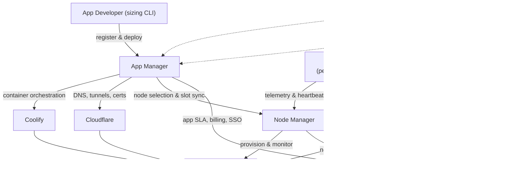

# V-Decent Infrastructure Capabilities

> **Purpose.** Master reference for what the V-Decent infrastructure offers, grounded in the shipped code of six source repositories — `vdecent-node-manager`, `vdecent-app-manager`, `vdecent-operations-platform`, `vdecent-app-sizing`, `vdecent-codex-skills`, `vdecent-support-skills`. Audience-specific briefings are derived from this document.
>
> **Status.** Work in progress — this document is assembled incrementally; only §1 (Ecosystem Overview) has been authored so far. Chapters 2-8 (App Sizing, Node Manager, App Manager, Operations Platform, Codex Skills, Support Skills, Audience Mapping) are appended by subsequent tasks.

## 1. Ecosystem Overview

### 1.1 What V-Decent Is

V-Decent is a distributed cloud/hosting ecosystem built on a fleet of edge compute nodes — low-cost MiniPCs running Docker and Coolify behind Cloudflare tunnels. The Node Manager operates the hardware layer (node onboarding, telemetry, capacity, uptime SLA) and the App Manager operates the application layer (app registration, deployment, domains, self-healing). Around them sit the Operations Platform, which provides SSO identity and billing against monthly SLA data, a developer-side sizing tool (`vdecent-app-sizing`), and two agent skill packs for AI-assisted operations (`vdecent-codex-skills`, `vdecent-support-skills`).

### 1.2 Component Relationship Diagram

### 1.3 Data Flows

1. **Identity** — The Operations Platform is the identity authority: it signs RS256 JWTs after Google/GitHub OAuth (`vdecent-operations-platform/backend/auth.py`). The Node Manager and App Manager authenticate their users through the Operations Platform (SSO callbacks and internal verification endpoints) and exchange manager-to-manager API calls using a shared internal token.
2. **Billing / SLA** — SLA data flows to the Operations Platform each month: the App Manager's per-app SLA data and the Node Manager's per-node SLA data are captured as month/year-keyed `AppSlaSnapshot` / `NodeSlaSnapshot` rows that feed invoices and payouts (`vdecent-operations-platform/backend/scripts/inject_sla_snapshots.py`).
3. **Telemetry** — Sentinel, a containerized agent on every node, pushes hardware telemetry (CPU, RAM, disk, uptime) and heartbeats to the Node Manager's `/api/webhooks/telemetry`, where heartbeats drive the rolling-30-day SLA and a Dead Man's Switch flags offline nodes (`vdecent-node-manager/backend/sentinel/main.py`). The same agent reports heartbeats to the App Manager webhook so node-slot state stays current; for placement the App Manager picks the highest-scored node that is Online, has a Cloudflare tunnel, and has free slots (`vdecent-app-manager/backend/services/orchestrator.py`).
4. **Deploy / DNS** — The App Manager registers an app from its GitHub repository, analyzes the Compose manifest, creates the application in Coolify on a selected node and triggers the deploy, then programs Cloudflare DNS records and Custom Hostnames to route the app's FQDN through the node's tunnel (`vdecent-app-manager/backend/services/orchestrator.py`, `vdecent-app-manager/backend/clients/coolify.py`, `vdecent-app-manager/backend/clients/cloudflare.py`).

### 1.4 Glossary

Glossary terms are defined once here and reused by later chapters without redefinition.

| Term | Definition |
| --- | --- |
| **VRU** (V-Decent Resource Unit) | Standardized capacity unit. One VRU = 0.2 CPU cores / 0.5 GB RAM / 5 GB disk at node level (`vdecent-node-manager/backend/services/vru_capacity.py`). |
| **Categories S / M / L / XL** | App size tiers occupying 1 / 2 / 4 / 8 VRU slots at the App Manager (`vdecent-app-manager/backend/utils/sizing.py`). |
| **SLA tiers** | Node uptime SLA computed over a rolling 30-day heartbeat window: **FULL** ≥ 99.9%, **PARTIAL** ≥ 95.0%, otherwise **FREE** (`vdecent-node-manager/backend/main.py`). |
| **Sentinel** | Per-node agent container that pushes telemetry and heartbeats to the managers (`vdecent-node-manager/backend/sentinel/main.py`). |
| **Developer Groups** | App Manager scoping unit for visibility and billing (`vdecent-app-manager/backend/models.py`). |
| **Coolify** | Self-hosted PaaS used as the container orchestrator on every node. |
| **Cloudflare** | Provides DNS records, tunnels, and certificates (Custom Hostnames) that route traffic to apps on nodes. |