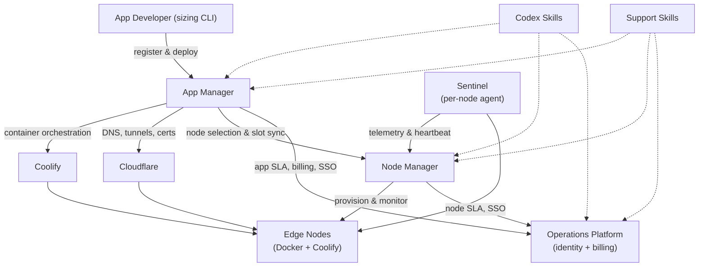

# V-Decent Infrastructure Capabilities

> **Purpose.** Master reference for what the V-Decent infrastructure offers, grounded in the shipped code of six source repositories — `vdecent-node-manager`, `vdecent-app-manager`, `vdecent-operations-platform`, `vdecent-app-sizing`, `vdecent-codex-skills`, `vdecent-support-skills`. Audience-specific briefings are derived from this document.
>
> **Status.** Work in progress — this document is assembled incrementally; only §1 (Ecosystem Overview) has been authored so far. Chapters 2-8 (App Sizing, Node Manager, App Manager, Operations Platform, Codex Skills, Support Skills, Audience Mapping) are appended by subsequent tasks.

## 1. Ecosystem Overview

### 1.1 What V-Decent Is

V-Decent is a distributed cloud/hosting ecosystem built on a fleet of edge compute nodes — low-cost MiniPCs running Docker and Coolify behind Cloudflare tunnels. The Node Manager operates the hardware layer (node onboarding, telemetry, capacity, uptime SLA) and the App Manager operates the application layer (app registration, deployment, domains, self-healing). Around them sit the Operations Platform, which provides SSO identity and billing against monthly SLA data, a developer-side sizing tool (`vdecent-app-sizing`), and two agent skill packs for AI-assisted operations (`vdecent-codex-skills`, `vdecent-support-skills`).

### 1.2 Component Relationship Diagram

### 1.3 Data Flows

1. **Identity** — The Operations Platform is the identity authority: it signs RS256 JWTs after Google/GitHub OAuth (`vdecent-operations-platform/backend/auth.py`). The Node Manager and App Manager authenticate their users through the Operations Platform (SSO callbacks and internal verification endpoints) and exchange manager-to-manager API calls using a shared internal token.
2. **Billing / SLA** — SLA data flows to the Operations Platform each month: the App Manager's per-app SLA data and the Node Manager's per-node SLA data are captured as month/year-keyed `AppSlaSnapshot` / `NodeSlaSnapshot` rows that feed invoices and payouts (`vdecent-operations-platform/backend/scripts/inject_sla_snapshots.py`).
3. **Telemetry** — Sentinel, a containerized agent on every node, pushes hardware telemetry (CPU, RAM, disk, uptime) and heartbeats to the Node Manager's `/api/webhooks/telemetry`, where heartbeats drive the rolling-30-day SLA and a Dead Man's Switch flags offline nodes (`vdecent-node-manager/backend/sentinel/main.py`). The same agent reports heartbeats to the App Manager webhook so node-slot state stays current; for placement the App Manager picks the highest-scored node that is Online, has a Cloudflare tunnel, and has free slots (`vdecent-app-manager/backend/services/orchestrator.py`).
4. **Deploy / DNS** — The App Manager registers an app from its GitHub repository, analyzes the Compose manifest, creates the application in Coolify on a selected node and triggers the deploy, then programs Cloudflare DNS records and Custom Hostnames to route the app's FQDN through the node's tunnel (`vdecent-app-manager/backend/services/orchestrator.py`, `vdecent-app-manager/backend/clients/coolify.py`, `vdecent-app-manager/backend/clients/cloudflare.py`).

### 1.4 Glossary

Glossary terms are defined once here and reused by later chapters without redefinition.

| Term | Definition |
| --- | --- |
| **VRU** (V-Decent Resource Unit) | Standardized capacity unit. One VRU = 0.2 CPU cores / 0.5 GB RAM / 5 GB disk at node level (`vdecent-node-manager/backend/services/vru_capacity.py`). |
| **Categories S / M / L / XL** | App size tiers occupying 1 / 2 / 4 / 8 VRU slots at the App Manager (`vdecent-app-manager/backend/utils/sizing.py`). |
| **Test Mode** | 14-day trial mode (`TEST_MODE_TTL_DAYS`, default 14) letting apps register as category N/A with no declared resource limits; auto-suspended at expiry (quota default 2 per developer group) until promoted to production (`vdecent-app-manager/backend/crud.py`, `vdecent-app-manager/backend/tasks/testmode_cleanup.py`). |
| **SLA tiers** | Node uptime SLA computed over a rolling 30-day heartbeat window: **FULL** ≥ 99.9%, **PARTIAL** ≥ 95.0%, otherwise **FREE** (`vdecent-node-manager/backend/main.py`). |
| **Sentinel** | Per-node agent container that pushes telemetry and heartbeats to the managers (`vdecent-node-manager/backend/sentinel/main.py`). |
| **Developer Groups** | App Manager scoping unit for visibility and billing (`vdecent-app-manager/backend/models.py`). |
| **Coolify** | Self-hosted PaaS used as the container orchestrator on every node. |
| **Cloudflare** | Provides DNS records, tunnels, and certificates (Custom Hostnames) that route traffic to apps on nodes. |

## 2. App Sizing

### 2.1 Role in the Ecosystem

`vdecent-app-sizing` is the developer-side sizing tool. It is a Python CLI (`vdecent-size`) that profiles a running local Docker Compose stack against the live Docker daemon and computes a standardized V-Decent Resource Unit (VRU) score, resolves the app to a hosting category (S / M / L / XL), and emits a per-service Compose recommendation (`cpus`, `mem_limit`, …) that the developer takes into production. It is the only tool that produces the category semantics ([Section 1.4](#14-glossary), S/M/L/XL = 1/2/4/8 VRU slots) from a real workload, so the App Manager's sizing checks and the Operations Platform's billing both assume its output.

### 2.2 Capabilities Offered

- **`vdecent-size profile` CLI** — the single entry point (`vdecent-app-sizing/vdecent_size/cli.py`), with flags:
  - `--duration <minutes>` (float, required) — profiling window; `duration_seconds = max(1, int(duration * 60))`, so 0.1 gives the minimum ~6-second window.
  - `-f, --compose-file <path>` — path to the Compose file.
  - `-p, --project-name <name>` — target Compose project name.
  - `-o, --output <path>` — JSON report path (default `vdecent-size.json`).
- **Target auto-detection** (`vdecent_size/profiler.py::detect_project_name`) — three explicit modes plus a daemon fallback:
  1. `--project-name` is used verbatim.
  2. `--compose-file` is read; the YAML top-level `name:` key is used, falling back to the lowercase parent-directory name.
  3. Otherwise the current directory is searched for `compose.yaml`, `compose.yml`, `docker-compose.yaml`, `docker-compose.yml` (same `name:` / lowercase-CWD-name rule).
  4. If none is found, running containers' `com.docker.compose.project` labels are inspected: exactly one running project is auto-selected; several require `-p`/`-f`; none is an error.
- **1-second telemetry ticks** over the window — each tick polls every container's Docker stats concurrently, yielding a live status line (CPU / RAM); the collected history drives project-level averages and peaks.
- **Per-service avg/peak CPU & RAM** — CPU is computed as fractional vCPUs (`cpu_delta / system_delta × online_cpus`); RAM is the working set in GB (`usage − cache`, falling back to `inactive_file`). Each service reports `avg_cpu_vcpus`, `peak_cpu_vcpus`, `avg_ram_gb`, `peak_ram_gb`; project peaks are the maximum observed tick sums.
- **Storage footprint** — total persistent storage in GB = sum of each container's write layer (`SizeRw`), plus **unique** named volumes and **unique** bind mounts (deduplicated across containers). Named volumes are measured from the host mountpoint when readable, otherwise via a temporary `alpine:latest` helper container running `du -sk` on the mounted volume (avoids `/var/lib/docker` permission issues).
- **VRU formula** (`vdecent-app-sizing/vdecent_size/formulas.py`):
  - `base_vru = 0.3 · (avg_cpu / 0.2) + 0.7 · (avg_ram / 0.5)` — i.e. the fraction of one VRU of CPU (0.2 vCPU) and one VRU of RAM (0.5 GB), weighted 30/70.
  - `storage_penalty = max(0, (actual_storage_gb − tier_fair_share_gb) / 25)`.
  - `final_vru = base_vru + storage_penalty`.
- **Tier resolution** — tiers are tested smallest-to-largest because the storage penalty's ceiling depends on the tier; fair-share storage ceilings are S 5 GB / M 10 GB / L 20 GB / XL 40 GB, and final-VRU bounds are **S ≤ 1.2, M ≤ 2.4, L ≤ 4.8**, otherwise **XL**.
- **Per-service Compose recommendation** — the tier's CPU budget (hundredths of a core) and memory budget (MB) are apportioned across services by **largest-remainder** proportional allocation over observed average CPU / RAM. Output per service: `cpus` (fractional), `mem_limit`, `memswap_limit` (= `mem_limit`, no swap headroom), `mem_swappiness: 0`.
- **No-swap rule** — swap is flagged when a container's `HostConfig` allows it (`MemorySwap == -1` unlimited, or `MemorySwap > Memory`) or live swap usage was recorded; the report then prints an alert that swap "violates the strict V-Decent no-swap production architecture rules … can degrade cluster scheduling stability and hide OOM events."
- **Dual output** — an ASCII terminal report (score, tier, telemetry table, storage breakdown, YAML Compose snippet, warnings, deployment instructions) and a machine-readable `vdecent-size.json` (default) containing `project_name`, `duration_minutes`, avg/peak CPU & RAM, `storage_gb`, `storage_penalty`, `vru_score`, `deterministic_size`, `service_metrics`, `compose_recommendation`, and a disclaimer.

### 2.3 Who Interacts with It & How

App developers run the CLI locally before deploying (`pip install -e .`, then `vdecent-size profile --duration 1`). It is CLI-only by design — the tool must attach to the developer's own local Docker daemon and cannot run server-side. Downstream consumption is via the produced artifacts: the reported `deterministic_size` must be given to the App Manager at app registration, the per-service limits are copied into the production Compose file, and `vdecent_size.formulas` can be imported directly by tooling that needs the VRU/tier math without profiling.

### 2.4 Key Constraints & Behaviors

- Requires a **running local Docker daemon with live containers** for the target project; telemetry aborts with an error if no container matches `com.docker.compose.project=<name>`.
- `--duration` is in minutes (float) with a practical floor of ~6 seconds; the window is an integer number of 1-second ticks.
- **RAM is the strict capacity ceiling**: it carries the 0.7 majority weight in the VRU formula, `mem_limit` is emitted as the hard memory cap, and the no-swap rule (`memswap_limit = mem_limit`, `mem_swappiness: 0`, swap-usage alerting) prevents RAM pressure from spilling to disk.
- Storage penalty depends on the resolved tier's fair-share ceiling, which is why tiers are evaluated smallest-to-largest.
- The CLI advises copying the generated per-service limits into the production `docker-compose.yaml` and the resolved size into the App Manager, and recommends moving up a tier if real-world workloads underperform.
- Both the report and the JSON carry a **"test ≠ production" disclaimer**: the sizing reflects the local test, production usage may require more (typically more, since local profiling runs with minimal load).

### 2.5 Source References

- `vdecent-app-sizing/vdecent_size/cli.py` — CLI, report formatting, JSON export.
- `vdecent-app-sizing/vdecent_size/formulas.py` — VRU formula, storage penalty, tier resolution, largest-remainder allocation.
- `vdecent-app-sizing/vdecent_size/profiler.py` — project detection, telemetry loop, CPU/RAM/swap/storage measurement.

## 3. Node Manager

### 3.1 Role in the Ecosystem

`vdecent-node-manager` is the edge-node / hardware orchestration layer. It owns the full lifecycle of the physical fleet: node records are created in a `WAITING_ACTIVATION` state with an activation code, a partner's machine enrolls against that code and is bound to the record, a five-command provisioning queue turns the bare machine into an enrolled node (SSH, Docker, Sentinel, Cloudflare tunnel), and thereafter the Node Manager collects telemetry, computes container-slot capacity and per-node VRU capacity, tracks uptime SLA for billing, and retires or self-decommissions nodes on exit. Its per-node ingress priority score (0–1000) is what the App Manager uses to pick where an app is placed, and it pushes node-status changes back to the App Manager.

### 3.2 Capabilities Offered

- **Node registration & provisioning**:
  - A node record is registered by an operator/partner via the admin console or API with status `WAITING_ACTIVATION`; registration issues a **single-use activation code** in the form `VDC-XXX-XXX` — six characters drawn from `ABCDEFGHJKMNPQRSTUVWXYZ23456789` group 3+3 for readability (`vdecent-node-manager/backend/main.py`, `generate_activation_code`).
  - Codes **expire after `ACTIVATION_CODE_TTL_HOURS`** (default **72 h** via `get_code_ttl`, floor 1 h) and can only be refreshed while the node is still waiting for activation. At enrollment, matching is case/dash-insensitive, and used or expired codes are rejected.
  - The bootstrap flow is agent-downloaded, not bundled: `GET /nodes/agent-bundle` streams a zip of `register-node.sh`, the Python agent (`vdecent_agent.py`), the Sentinel sources, `cleanup-node.sh` (decommission path), the partner agreement, and a README; `GET /install` serves a bootstrap script that fetches the bundle, unpacks it, and runs `register-node.sh` on the node (`vdecent-node-manager/backend/node-agent/register-node.sh`).
  - On enrollment (`POST /enroll`) the machine's MAC/`machine_uuid` are bound, the node adopts the platform's hostname, status transitions to `ACTIVATED`, and **five provisioning commands are enqueued** in this exact order (`vdecent-node-manager/backend/main.py`):
    1. `INITIAL_SETUP` — hostname, SSH public key, sentinel token, AM heartbeat URL.
    2. `CONFIGURE_SSH` — rebind sshd to the node's configured SSH port and restart it.
    3. `INSTALL_DOCKER` — install the Docker engine.
    4. `SETUP_SENTINEL` — launch the Sentinel container with its tokens and webhook URLs.
    5. `SETUP_CLOUDFLARE` — queued as `PREPARING`; the tunnel/DNS/Coolify bring-up runs in the background.
  - The agent polls `GET /nodes/{node_id}/commands` on a ~15–30 s loop and reports each command through `POST /nodes/{node_id}/commands/{command_id}/report`, from which the Node Manager derives a **global provisioning progress** (monotone ranges: `INITIAL_SETUP` 5–25, `CONFIGURE_SSH` 25–45, `INSTALL_DOCKER` 45–65, `SETUP_CLOUDFLARE` 65–85) and moves node status through `DOCKER_INSTALLING` / `SSH_CONFIGURING` to fully enrolled. The agent's reported hardware specs feed the VRU capacity calculation.
- **Sentinel telemetry + Dead Man's Switch** — the Sentinel container (`vdecent-node-manager/backend/sentinel/main.py`) runs a loop every `INTERVAL_SECONDS` (default **60 s**) and pushes to two targets:
  - `POST /api/webhooks/telemetry` (Node Manager): `node_id` + sentinel token auth, CPU/RAM/disk percent, network rx/tx bytes, uptime, and an SSH-health flag. The Node Manager records that interval's heartbeat window, updates live telemetry, throttles the history sample into 5-minute buckets (`SAMPLE_CADENCE_SECONDS = 300`), recomputes the ingress priority score, and flips any `OFFLINE`/`ERROR` node back to `ONLINE`.
  - the App Manager heartbeat webhook — per-Compose-project container health inventory (Healthy/Unhealthy, CPU/RAM) that keeps App Manager's node view current.
  - A periodic `run_global_health_check` (every `NODE_HEARTBEAT_INTERVAL_SECS`, default 60 s) is the **Dead Man's Switch**: a node is declared offline when its last heartbeat is older than `heartbeat_interval_seconds × HEARTBEAT_TIMEOUT_MULTIPLIER` (multiplier `3` in `vdecent-node-manager/backend/services/sla.py`; default grace ≈ **180 s**). The node is marked `OFFLINE` and the App Manager is notified.
- **VRU capacity per node** (`vdecent-node-manager/backend/services/vru_capacity.py`) — total capacity is the **most restrictive** resource dimension divided by the VRU base of **0.2 CPU cores / 0.5 GB RAM / 5 GB disk**, rounded down: `min(cpu/0.2, memory/0.5, storage/5)`. `total_vru_capacity` and the deployable `app_capacity_slot` are synchronized whenever the agent reports specs, preserving any operator-set manual limit that is lower.
- **App-capacity slot accounting** — each node tracks `app_capacity_slot` (total VRU slots) versus `app_slot_occupied` (slots currently claimed by deployed apps); App Manager updates usage through the installed-apps endpoints (`GET`/`PATCH /nodes/{node_id}/installed-apps`), and the ingress score only considers nodes with free slots.
- **Ingress priority scoring 0–1000** (`vdecent-node-manager/backend/services/scoring.py`):
  - Status gate first: only `ONLINE`/`SSH_READY` nodes that reported within the last 5 minutes and have positive free slot capacity are scored (others score 0).
  - **Capacity (max 400)** — `remaining_slots / capacity_slots × 400`.
  - **Live telemetry headroom (max 300)** — `(100 − cpu%) + (100 − mem%) + (100 − disk%)`, with an overload penalty of −150 (floored at 0) if any of CPU/memory/disk exceed **90%**.
  - **Partner incentive (max 300)** — partner points capped at 1000, scaled by 0.3.
  - Sum is taken as an integer and clamped to `[0, 1000]`; recomputed on every telemetry webhook.
- **SLA tracking + tiers** (`vdecent-node-manager/backend/services/sla.py`) — uptime is measured in **heartbeat windows**: at most one pulse counts per interval (default 60 s), deduplicated by `unix_ts // interval`. `calculate_window_sla` returns `received/expected × 100` over a period, and trailing windows inside the `3 × interval` grace period are not yet classified. Tiers (`vdecent-node-manager/backend/main.py`): **FULL** ≥ `SLA_FULL_PERCENTAGE` (default **99.9%**), **PARTIAL** ≥ `SLA_PARTIAL_PERCENTAGE` (default **95.0%**), otherwise **FREE**. Each node offers a rolling 30-day SLA view plus up to 12 months of calendar history.
- **Billing export for Ops Platform** — `GET /api/v1/billing/nodes-sla?month=&year=` exports a calendar-month snapshot for every node: SLA percentage, received/expected pulses, heartbeat interval, total VRU capacity, partner identity (including regional-master vs `sub_partners`), currency (`BRL`), and the active tier thresholds — the data the Operations Platform reconciles into payouts.
- **IAM / multi-tenant** — local users (Admin/Viewer roles, username+password) and **Ops-SSO accounts** resolved through `POST /auth/oauth-session` using the roles the Operations Platform already granted (`GLOBAL_ADMIN`, `LOCAL_ADMIN`, `OP_OPERATOR`, `NODE_PARTNER`); OAuth-managed accounts are read-only in the Node Manager console. Visibility is hierarchical: partners are scoped (`get_visible_partner_ids`), a regional-master partner (`is_regional`) covers its `sub_partners`/children, and non-global users only see nodes of visible partners.
- **Google Drive backups** — the backend proxies to a **backup sidecar** (`vdecent-node-manager/sidecar/backup.py`) that `pg_dump`s the database and uploads the file to Google Drive (Drive v3 API); endpoints `GET /system/backups`, `POST /system/backup`, and `POST /system/purge`.

### 3.3 Who Interacts with It & How

- **Node partners** — enroll their own hardware: they run the bootstrap script (`/install` download or the agent bundle), are prompted for their `VDC-XXX-XXX` activation code, and then watch provisioning progress, telemetry, and SLA of their nodes in the web console. Self-decommissioning is available via the cleanup script (`cleanup-node.sh`).
- **Operators / administrators** — the console: register node records and issue/refresh activation codes, review enrollment and provisioning logs, set system settings (heartbeat interval, SLA thresholds, activation-code TTL), manage local/Ops users and partner hierarchies, and trigger backups. REST API on **port 3001** (uvicorn `--port 3001`, `vdecent-node-manager/docker-compose.dev.yaml`), gated by a static API token plus per-user auth.
- **Node agents** — the bootstrap agent (`vdecent_agent.py`) and the Sentinel container are the machine-side actors; the agent polls and executes the command queue, the Sentinel pushes heartbeats/telemetry.
- **App Manager** — consumes node status, capacity slots, and ingress priority scores for placement decisions, updates slot occupancy, and receives `node-status` webhooks (`Online`/`Offline`, including Dead Man's Switch timeouts) at `POST /api/webhooks/node-status`.

### 3.4 Key Constraints & Behaviors

- **Enrollment is gated on demand**: if no node is in `WAITING_ACTIVATION`, the `/enroll` endpoint rejects the attempt (404) and logs a security event — the platform must be opened for enrollment (by creating a node record) before any machine can join.
- **Activation codes** are single-use, TTL-limited (default 72 h), and refreshable only while the node still waits for activation; used or expired codes are rejected at enrollment.
- The enrolling machine **adopts the platform-assigned hostname** for its node; the address/identity the platform manages is the record's, not the hardware's.
- **Retired hostnames are permanently reserved**: deletion of an activated node retires it (record, command/uptime history and partner association preserved for billing and audit), and its hostname cannot be reused. Nodes that never activated are hard-deleted.
- **Dead Man's Switch**: offline detection at `3 × heartbeat interval` (default ≈ 180 s); recovery is automatic on the next telemetry heartbeat.
- **Network posture**: Sentinel/agent traffic is outbound to the manager webhooks; node access (including SSH) is routed through the Cloudflare tunnel rather than exposed directly — the agent rebinds `sshd` to the node's configured SSH port and installs the Manager's public key (notably, it leaves `PasswordAuthentication`/`PermitRootLogin` as found; no firewall rules are applied by the provisioning code).
- System timezone defaults to **`America/Sao_Paulo`** (`TIMEZONE`); SLA windows are computed in UTC.
- The backend API listens on **port 3001**; the node agent's default Node Manager URL is `http://localhost:3001` for local testing.

### 3.5 Source References

- `vdecent-node-manager/backend/main.py` — API, registration/enrollment, 5-step command queue, Dead Man's Switch, SLA tiers, billing export, IAM, backups.
- `vdecent-node-manager/backend/services/vru_capacity.py` — VRU capacity formula and slot synchronization.
- `vdecent-node-manager/backend/services/scoring.py` — ingress priority scoring (0–1000).
- `vdecent-node-manager/backend/services/sla.py` — heartbeat-window SLA math and timeout multiplier.
- `vdecent-node-manager/backend/services/telemetry.py` — on-demand SSH telemetry refresh path.
- `vdecent-node-manager/backend/sentinel/main.py` — Sentinel agent loop and telemetry/heartbeat pushes.
- `vdecent-node-manager/backend/node-agent/vdecent_agent.py`, `vdecent-node-manager/backend/node-agent/register-node.sh` — bootstrap and command execution.
- `vdecent-node-manager/sidecar/backup.py` — `pg_dump` + Google Drive upload.